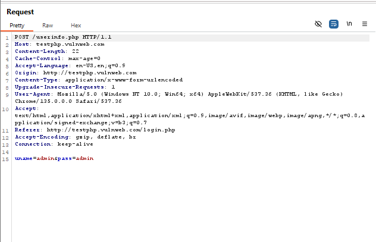

# ⚔️ Launch Brute Force Attacks

In this step, we will cover how to launch brute force attacks using various tools. There are several tools available for brute-forcing, such as **Hydra, Medusa, NetExec, Aircrack-ng, John the Ripper**, and more.

---

## 🔍 What is a Brute Force Attack?

A **brute force attack** is a method where an attacker systematically attempts all possible passwords or keys until the correct one is found. It relies on predefined wordlists or patterns. While time-consuming, it can be highly effective if proper security measures are not in place.

---

## 🛠️ Brute Force Tools Overview

Here’s a quick summary of the brute-force tools used in this lab:

| **Tool**         | **Description** |
|------------------|-----------------|
| **Hydra**        | - Fast and flexible network login cracker. <br> - Supports dictionary attacks on over 30 protocols (e.g., FTP, SSH, HTTP). |
| **Medusa**       | - Open-source command-line login brute-forcer. <br> - Optimized for speed and parallel testing. |
| **NetExec**      | - Post-exploitation and credential testing tool. <br> - Useful for testing credentials across network services like SMB, RDP, WinRM, and MSSQL. |
| **Burp Intruder** | - Used to automate attacks against HTTP login pages. |

---

## ⚙️ Brute Force Process

### 💻 FTP, TELNET, and SSH

1. **Identify the target and service to attack**:
   - **Target IP**: `192.168.193.137`
   - **Services**: FTP, SSH, TELNET

2. **Select the appropriate tool for the protocol.**

3. **Prepare a list of usernames and passwords**:
   - `usernames.txt` is already prepared from the previous task.
   - For `passwords.txt`, extract the first 10 lines from `rockyou.txt` and append the known target password to make the attack quicker.

   > **Why only 10 passwords?**  
   > This reduces time and resources while still allowing us to test the known/target password quickly.

    ```bash
    head -n 10 /usr/share/wordlists/rockyou.txt > passwords.txt
    echo 'targetpassword' >> passwords.txt
    ```

4. Launch the brute force attack using the chosen tool and analyze the output to determine successful logins.

    **FTP -- NetExec**
    ```bash
    netexec ftp 192.168.193.137 -u usernames.txt -p passwords.txt
    ```
    Result:
    

    **SSH -- Medusa**
    ```bash
    medusa -h 192.168.193.137 -U usernames.txt -P passwords.txt -M ssh
    ```
    Result:
    
    .png)

    **TELNET -- Hydra**
    ```bash
    hydra -L usernames.txt -P passwords.txt -t 4 telnet://192.168.193.137
    ```
    Result:
    


### 🌐 HTTP Login Page

1. Target:
For this demonstration, we’ll use:
https://testphp.vulnweb.com/ (educational vulnerable website)

2. Configure Proxy in Burp Suite:

    Go to Proxy → Options, ensure it's set to 127.0.0.1:8080.

3. Open the Target Website in Burp’s Browser.
    This is how the page should looks like.
    

    Submit Dummy Credentials (e.g., admin:admin) 
    

4. After that, the request outcome will be like this. 
    
    - Right-click > Send to Intruder (Don't forward yet).

    - Switch to Cluster Bomb attack type.

    - Set payload positions on both username and password fields.

5. Go to the intruder tab, and highlight the username and right click and choose add payload or just click the 'add $'. Change the sniper attack to cluster bomb attack.

    

    
    

6. After setting up the payloads, click start attack. 
    .png)
    If you notice, all the status code and length is similar, but only for payload1(test) and payload2(test) has different status code and length. Assume that is the correct username and password.

    Below is the result after trying to login using test:test. 
    .png)


---

