# Lab 1 Walkthrough
- [Lab 1 Walkthrough](#lab-1-walkthrough)
- [🔍 **Enumerate the Vulnerable VM to Discover Usernames**](#-enumerate-the-vulnerable-vm-to-discover-usernames)
  - [⚙️ **Process**](#️-process)
- [⚔️ Launch Brute Force Attacks](#️-launch-brute-force-attacks)
  - [🔍 What is a Brute Force Attack?](#-what-is-a-brute-force-attack)
  - [🛠️ Brute Force Tools Overview](#️-brute-force-tools-overview)
  - [⚙️ Brute Force Process](#️-brute-force-process)
    - [💻 FTP, TELNET, and SSH](#-ftp-telnet-and-ssh)
    - [🌐 HTTP Login Page](#-http-login-page)
- [**Sniff Network Traffic**](#sniff-network-traffic)
  - [Process](#process)
    - [Wireshark](#wireshark)
- [Problem Encounters](#problem-encounters)
  - [🔒 Suggest Mitigation Strategies](#-suggest-mitigation-strategies)

# 🔍 **Enumerate the Vulnerable VM to Discover Usernames**

In this step, we'll discover a list of usernames that exist on the target system. These usernames will be useful later when performing brute-force attacks to crack passwords.

---

## ⚙️ **Process**

1. Identify the IP Address of Metasploitable 2  
Start your Metasploitable 2 VM and check the IP address.

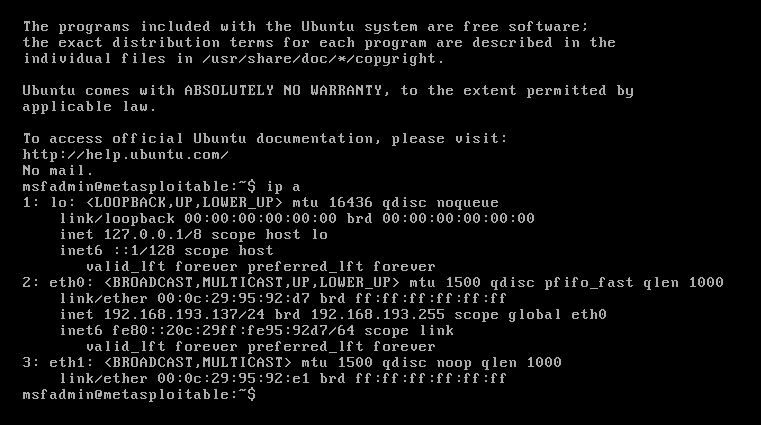

---

2. Scan for Open Ports Using `nmap`  
In your Kali Linux terminal, run the following command to identify services running on specific ports:

    ```bash
    nmap -sV 192.168.193.137
    ```
    

3. To find the list of usernames: 
    Run the command:
    ```bash
    enum4linux -a 192.168.193.137
    ```
    
    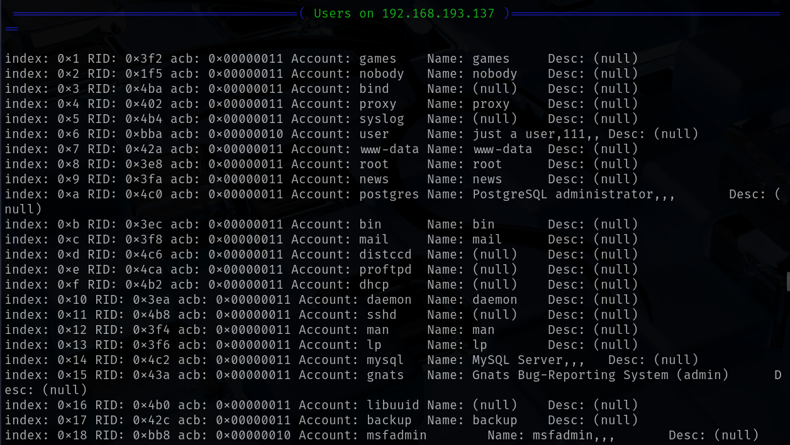

4. Here we will make a list of username in txt file so it easier to read and find.
    Run the command:
    ```bash
    enum4linux -a 192.168.193.137 | grep 'user:' | cut -d ':' -f2 | awk '{print $1}' > usernames.txt
    ```
    

    | **Option**         | **Explanation**    |
    | ---------------| ---------------|
    | enum4linux -a <target-ip> | Runs a full scan on the target |
    | grep 'user' | Filters lines that contain the word **user:** |
    | cut -d ':' -f2 | Cuts the line at the colon : and takes the second part.|
    | awk '{print $1}' | Cleans up the output by printing just the username. |
    | > username.txt | Saves the final list into a file called username.txt. |

    -- List of usernames:
    ```bash
    ┌──(sheba㉿NWS23010003)-[~/pickertwee/Crypto/Labworks/Labwork-01]
    └─$ cat usernames.txt   
    games
    nobody
    bind
    proxy
    syslog
    user
    www-data
    root
    news
    postgres
    bin
    mail
    distccd
    proftpd
    dhcp
    daemon
    sshd
    man
    lp
    mysql
    gnats
    libuuid
    backup
    msfadmin
    telnetd
    sys
    klog
    postfix
    service
    list
    irc
    ftp
    tomcat55
    sync
    uucp
    ```

# ⚔️ Launch Brute Force Attacks

In this step, we will cover how to launch brute force attacks using various tools. There are several tools available for brute-forcing, such as **Hydra, Medusa, NetExec, Aircrack-ng, John the Ripper**, and more.

---

## 🔍 What is a Brute Force Attack?

A **brute force attack** is a method where an attacker systematically attempts all possible passwords or keys until the correct one is found. It relies on predefined wordlists or patterns. While time-consuming, it can be highly effective if proper security measures are not in place.

---

## 🛠️ Brute Force Tools Overview

Here’s a quick summary of the brute-force tools used in this lab:

| **Tool**         | **Description** |
|------------------|-----------------|
| **Hydra**        | - Fast and flexible network login cracker. <br> - Supports dictionary attacks on over 30 protocols (e.g., FTP, SSH, HTTP). |
| **Medusa**       | - Open-source command-line login brute-forcer. <br> - Optimized for speed and parallel testing. |
| **NetExec**      | - Post-exploitation and credential testing tool. <br> - Useful for testing credentials across network services like SMB, RDP, WinRM, and MSSQL. |
| **Burp Intruder** | - Used to automate attacks against HTTP login pages. |

---

## ⚙️ Brute Force Process

### 💻 FTP, TELNET, and SSH

1. **Identify the target and service to attack**:
   - **Target IP**: `192.168.193.137`
   - **Services**: FTP, SSH, TELNET

2. **Select the appropriate tool for the protocol.**

3. **Prepare a list of usernames and passwords**:
   - `usernames.txt` is already prepared from the previous task.
   - For `passwords.txt`, extract the first 10 lines from `rockyou.txt` and append the known target password to make the attack quicker.

   > **Why only 10 passwords?**  
   > This reduces time and resources while still allowing us to test the known/target password quickly.

    ```bash
    head -n 10 /usr/share/wordlists/rockyou.txt > passwords.txt
    echo 'targetpassword' >> passwords.txt
    ```

4. Launch the brute force attack using the chosen tool and analyze the output to determine successful logins.

    **FTP -- NetExec**
    ```bash
    netexec ftp 192.168.193.137 -u usernames.txt -p passwords.txt
    ```
    Result:
    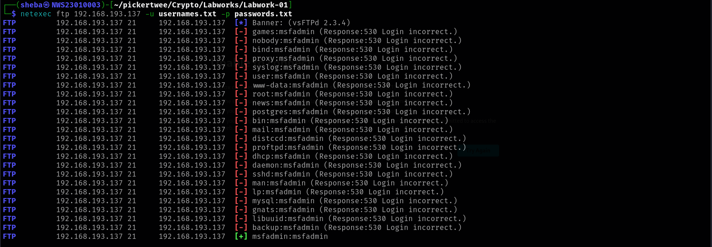

    **SSH -- Medusa**
    ```bash
    medusa -h 192.168.193.137 -U usernames.txt -P passwords.txt -M ssh
    ```
    Result:
    
    .png)

    **TELNET -- Hydra**
    ```bash
    hydra -L usernames.txt -P passwords.txt -t 4 telnet://192.168.193.137
    ```
    Result:
    


### 🌐 HTTP Login Page

1. Target:
For this demonstration, we’ll use:
https://testphp.vulnweb.com/ (educational vulnerable website)

2. Configure Proxy in Burp Suite:

    Go to Proxy → Options, ensure it's set to 127.0.0.1:8080.

3. Open the Target Website in Burp’s Browser.
    This is how the page should looks like.
    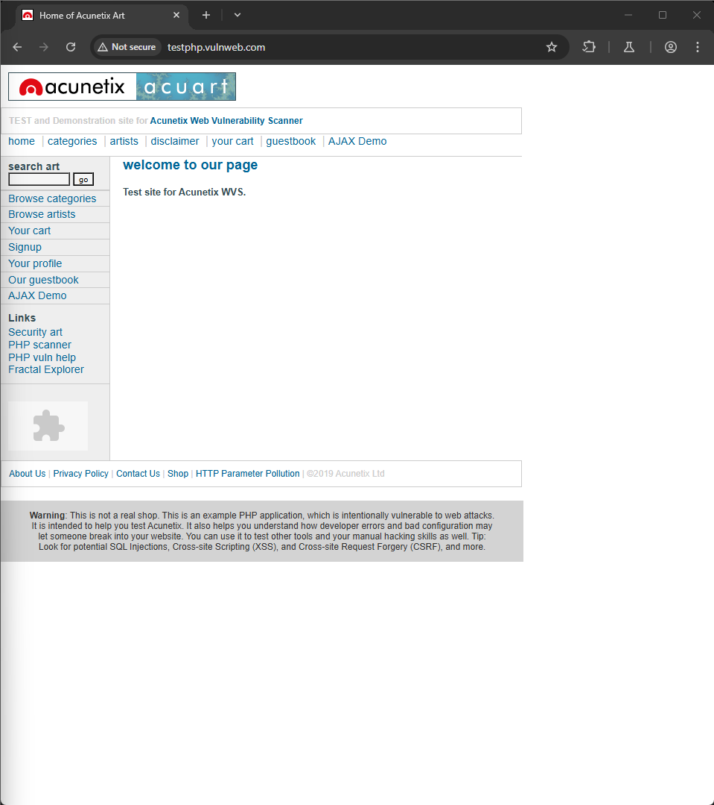

    Submit Dummy Credentials (e.g., admin:admin) 
    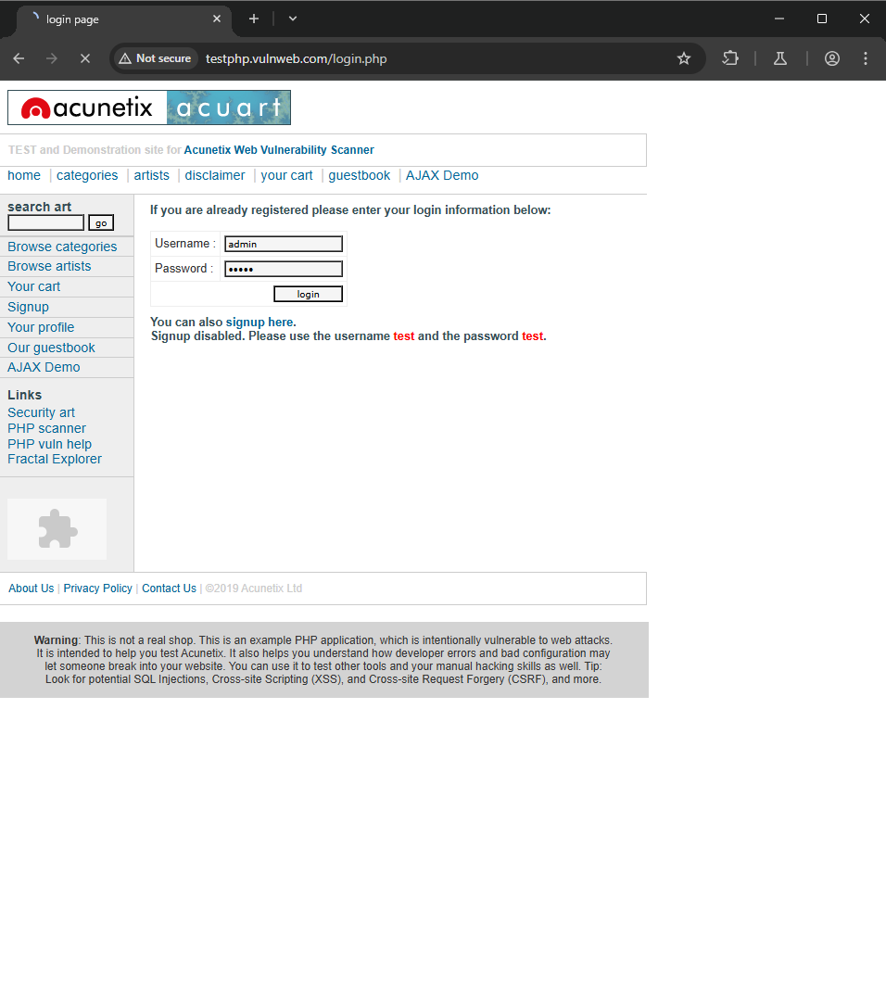

4. After that, the request outcome will be like this. 
    
    - Right-click > Send to Intruder (Don't forward yet).

    - Switch to Cluster Bomb attack type.

    - Set payload positions on both username and password fields.

5. Go to the intruder tab, and highlight the username and right click and choose add payload or just click the 'add $'. Change the sniper attack to cluster bomb attack.

    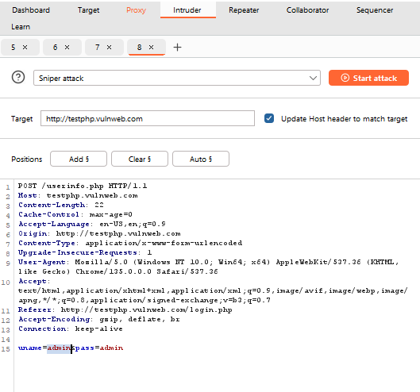

    
    

6. After setting up the payloads, click start attack. 
    .png)
    If you notice, all the status code and length is similar, but only for payload1(test) and payload2(test) has different status code and length. Assume that is the correct username and password.

    Below is the result after trying to login using test:test. 
    .png)


---

# **Sniff Network Traffic**
In this lab, we will be sniffing the traffic of ftp, ssh, telnet, and http using wirieshark.

## Process 
To start the sniffing, we need to log in to the service first.
1. FTP
    ```bash
    ftp 192.168.193.137
    ```
    Result:
    

2. TELNET 
    ```bash
    telnet 192.168.193.137
    ```
    Result:
    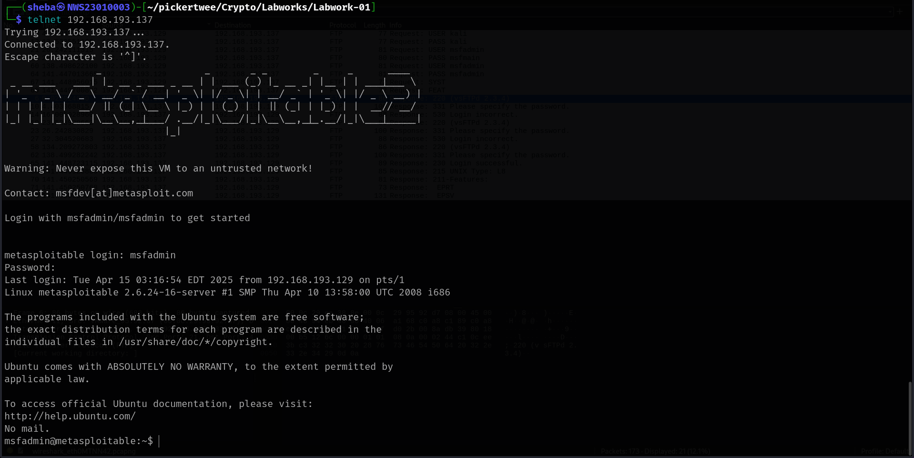

3. SSH
    ```bash
    ssh -oHostKeyAlgorithms=+ssh-rsa msfadmin@192.168.193.137
    ```
    Result:
    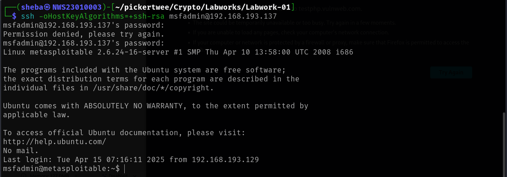

4. HTTP
    - Do the same thing as we brute force the website while open the wireshark. 

### Wireshark 

1. FTP
    - filter using **ftp** or  **tcp.port == 21** . 
    Result:
    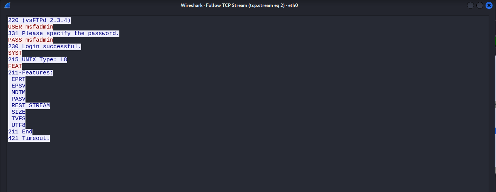

2. TELNET
    - filter using **telnet** or **tcp.port == 23** .
    Result:
    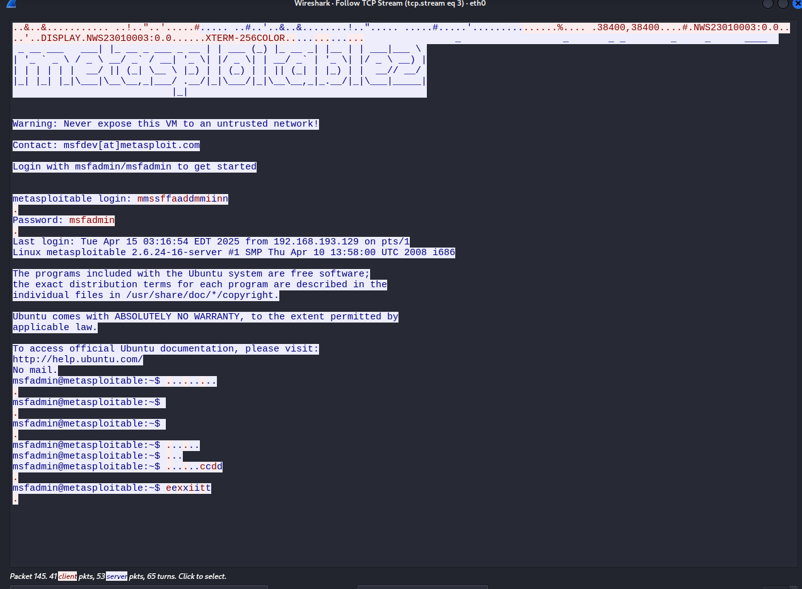

3. SSH
    - filter using **ssh** or **tcp.port == 22** .
    Result:
    

4. HTTP
    - filter using **http** .
    Result:
    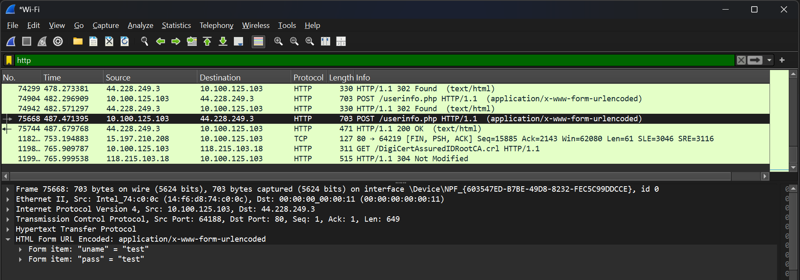


# Problem Encounters 

| **Issues**                         | **Solution**                                                      |
|------------------------------------|-------------------------------------------------------------------|
| SSH login failed (algorithm mismatch)  | Added `-oHostKeyAlgorithms=+ssh-rsa` to the SSH command to specify a matching algorithm. |
| Hydra failed on SSH                | Switched to Medusa for SSH brute-forcing, as Hydra encountered compatibility issues with SSH configurations. |
| Slow brute-forcing with Hydra      | Adjusted the number of tasks with `-t` option to improve performance (e.g., `-t 4` for reduced parallelism). |


## 🔒 Suggest Mitigation Strategies

| **Protocol** | **Replace With / Secure Option** | **Defense Mechanisms** |
|--------------|----------------------------------|-------------------------|
| FTP          | SFTP / FTPS                      | Encryption, lockouts, strong passwords |
| TELNET       | SSH                              | Encrypted channel, key-based auth |
| SSH          | Hardened SSH config              | Keys, fail2ban, disable root login |
| HTTP Login   | HTTPS + CAPTCHA / 2FA            | Encryption, rate-limits, multi-factor auth |


