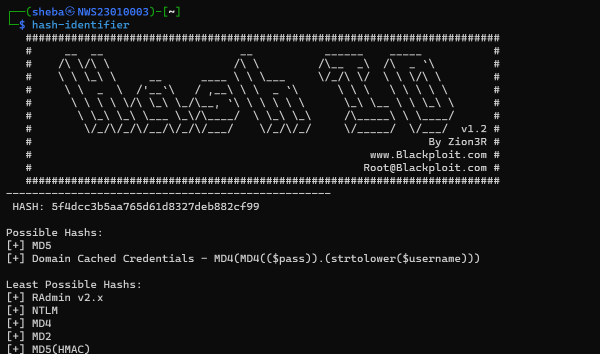

# Lab 2 Walkthrough

## Service Enumeration and Initial Access
Here we will try to get inside the target databases and see if there are any errors when we try to connect it from kali. 

1. First we need to scan the target to see if the databases port is open.

Command:
```bash
nmap -sV 192.168.193.137 #Target ip address
```

As you can see the result show the port 3306 - mysql is open.

2. After that, we try to connect the target databases using mysql command.

If you don't know how to use mysql command, you can run the command below: 
```bash 
tldr mysql
```

It will show how to use the command.

In order to connect with the target databases, we need to run this command:
```bash
mysql -h 192.168.193.137 -u root -p
```

It ask for password, which mean there is authentication needed. BUT the error stated that the target is trying to speak SSL. The thing is the server side (kali side) we don't even speak SSL (doesn't support SSL).

### Solving the issues:
I try to run the command 
```bash 
mysql -h 192.168.193.137 -u root --ssl-mode=DISABLED 
```

Still got error. Asked chatgpt, and it said that our MySQL target is kinda ancient.

So here I try to run another command to disabled the ssl:
```bash
mysql -h 192.168.193.137 -u root --skip-ssl
```

Here you go!! We got the access to the target databases~~

Besides the command, there is also another command you can use:
```bash
mysql -h 192.168.193.137 -u root --ssl=0 
```


## Enumeration of Users and Authentication Weakness
>If you don't know or forget the syntax for mysql 👉 [mysql-syntax note](https://github.com/pickertwee/Sheba-college-resources/blob/main/Semester%205/CBS%202373-CRYPTO/Notes/mysql-syntax.md)

To see the databases, run the command:
```bash
SHOW DATABASES;
```
> In mysql, it is not case sensitive. So, it does not matter to run the command in uppercase or lowercase.


The result show the list of databases that have in the target. 

In order to get inside the database that you want, run the command:
```bash
USE <databases-name>;
```


😯 Here is the interesting part, we will see if the database (the one you choose) is secure or not..
Insert the command: 
```bash
SELECT User, Host, Password FROM mysql;
```

🫢 WOAHHH.. As you can see, the password column for all of the users are empty. Which mean there are no password needed = unsecure databases. 

Lets see if it is true or not. 

Here I attempt to get access to the target database using the user **guest**

As you can see 👀, there are no password needed to get inside the user guest databases. Just like how we get inside the databases before using the user root.

❓ Questions:
  - **Is accessing a database with no password a cryptographic failure?**
    - Obviously yes~ Anyone could get inside your databases without to waste their time by doing brute force or any methods to get inside .
  - **Explain how this violates secure cryptographic authentication principles.**
    - Insecure authentication will lead to **exploitation, threat agents, detectability average** and etc. 
    - *[🤝 reference 1](https://owasp.org/www-project-mobile-top-10/2023-risks/m3-insecure-authentication-authorization)*
    - *[🤝 reference 2](https://owasp.org/www-project-mobile-top-10/2014-risks/m6-broken-cryptography)*

## Password Hash Discovery and Hash Identification
Here we will try to find out any databases that contain passwords🔒.

I choose the dvwa database and run the command:
```bash
SHOW TABLES; #to show the users that are available in the databases
```


After that, choose one user and run the command:
```bash
SELECT * FROM users;
```

As you can see, there are user and password information in the **users**. Lets extract the passwords🔑. 

🤔 What if you choose the guestbook???
    Using the same command:
```bash
SELECT * FROM guestbook;
```

 This is the content inside the guestbook. 😵‍💫 Boring~~~ 

Back to the users. As you can see, the passwords are encrypted. But what kind of encryption does it use? Based on the encryption, it is hashing method. But what kind of hashing is that?

🔎 To identify the hashing, you can use:
1. hashid
```bash
hashid 5f4dcc3b5aa765d61d8327deb882cf99
```


2. hash-identifier
```bash
hash-identifier
```


>Both tools get the job done, but **hash-identifier** is more likely to accurately identify the hashing method—which, in this case, is **MD5**.


