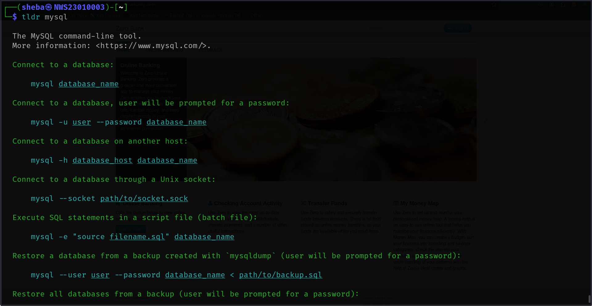
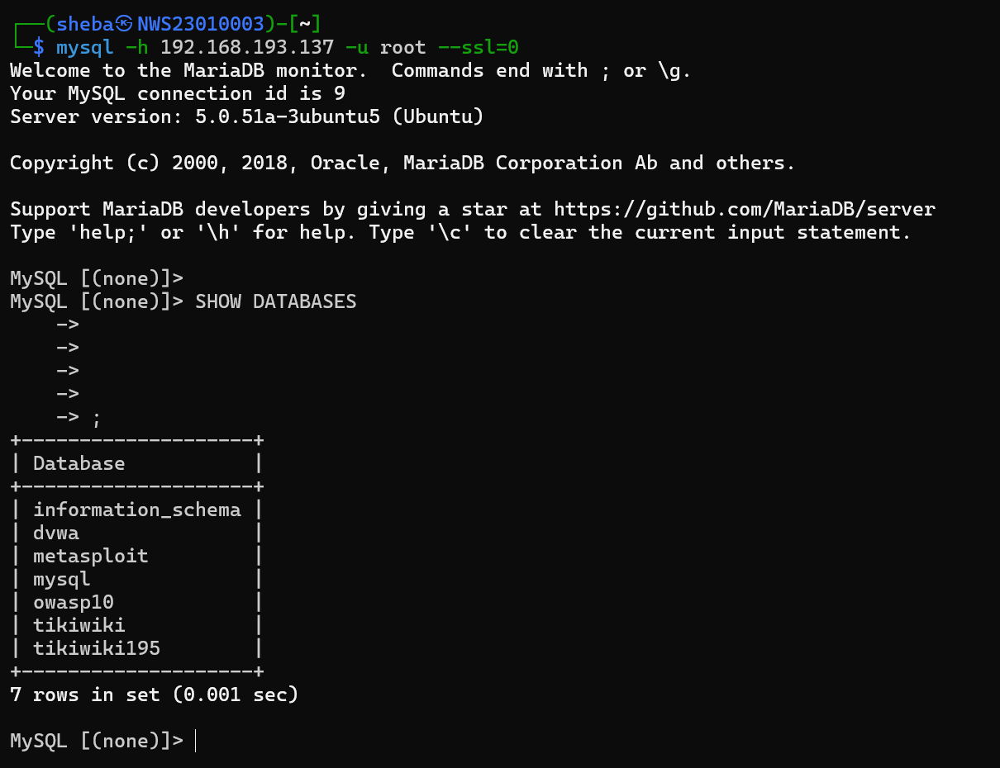
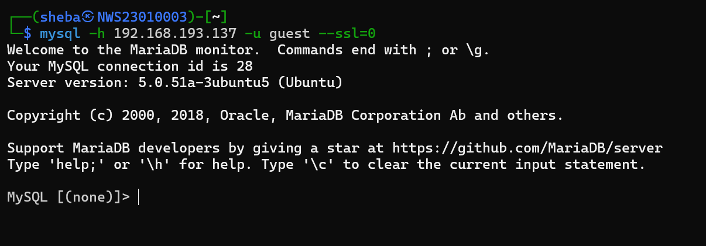
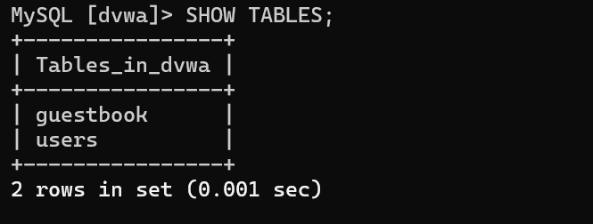
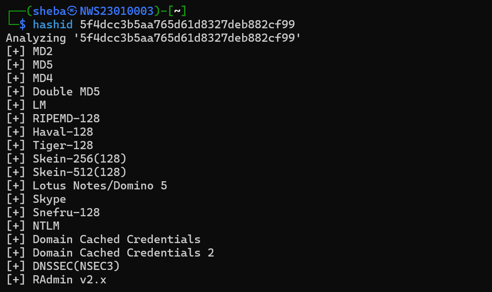
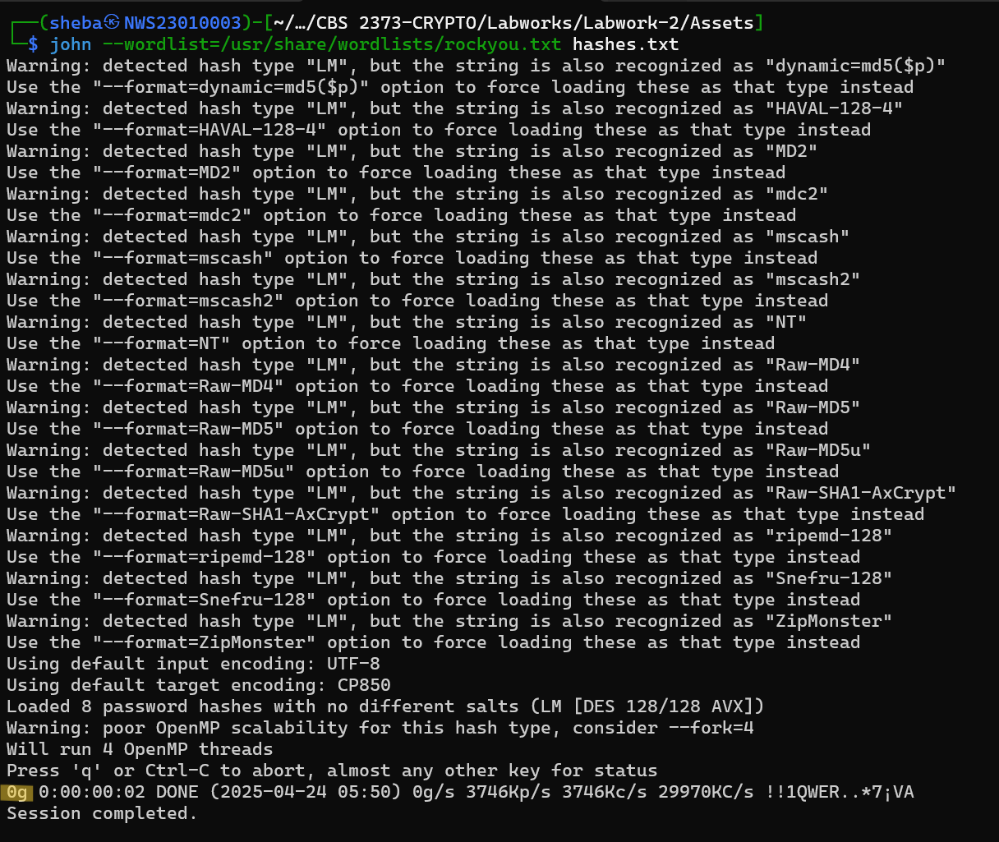

# Lab 2 Walkthrough
- [Lab 2 Walkthrough](#lab-2-walkthrough)
  - [Service Enumeration and Initial Access](#service-enumeration-and-initial-access)
    - [Solving the issues:](#solving-the-issues)
  - [Enumeration of Users and Authentication Weakness](#enumeration-of-users-and-authentication-weakness)
  - [Password Hash Discovery and Hash Identification](#password-hash-discovery-and-hash-identification)
  - [📵 Offline Hash Cracking](#-offline-hash-cracking)
    - [🧑‍💻 Cracking the password](#-cracking-the-password)
    - [Solving the issues:](#solving-the-issues-1)
    - [Lets do some **Entropy Analysis**](#lets-do-some-entropy-analysis)
  - [🔐 Cracked Password Entropy Analysis](#-cracked-password-entropy-analysis)
    - [🔎 Interpretation:](#-interpretation)
    - [Optional: Check supported formats](#optional-check-supported-formats)
  - [🔒 Cryptographic Analysis and Mitigation](#-cryptographic-analysis-and-mitigation)
    - [🧩 1. Authentication Flaws](#-1-authentication-flaws)
    - [🔓 2. Weak Password Hashing](#-2-weak-password-hashing)
    - [📡 3. Transmission of Data](#-3-transmission-of-data)

## Service Enumeration and Initial Access
Here we will try to get inside the target databases and see if there are any errors when we try to connect it from kali. 

1. First we need to scan the target to see if the databases port is open.

Command:
```bash
nmap -sV 192.168.193.137 #Target ip address
```

As you can see the result show the port 3306 - mysql is open.

2. After that, we try to connect the target databases using mysql command.

If you don't know how to use mysql command, you can run the command below: 
```bash 
tldr mysql
```

It will show how to use the command.

In order to connect with the target databases, we need to run this command:
```bash
mysql -h 192.168.193.137 -u root -p
```

It ask for password, which mean there is authentication needed. BUT the error stated that the target is trying to speak SSL. The thing is the server side (kali side) we don't even speak SSL (doesn't support SSL).

### Solving the issues:
I try to run the command 
```bash 
mysql -h 192.168.193.137 -u root --ssl-mode=DISABLED 
```


Still got error. Asked chatgpt, and it said that our MySQL target is kinda ancient.

So here I try to run another command to disabled the ssl:
```bash
mysql -h 192.168.193.137 -u root --skip-ssl
```

Here you go!! We got the access to the target databases~~

Besides the command, there is also another command you can use:
```bash
mysql -h 192.168.193.137 -u root --ssl=0 
```


## Enumeration of Users and Authentication Weakness
>If you don't know or forget the syntax for mysql 👉 [mysql-syntax note](https://github.com/pickertwee/Sheba-college-resources/blob/main/Semester%205/CBS%202373-CRYPTO/Notes/mysql-syntax.md)

To see the databases, run the command:
```bash
SHOW DATABASES;
```
> In mysql, it is not case sensitive. So, it does not matter to run the command in uppercase or lowercase.


The result show the list of databases that have in the target. 

In order to get inside the database that you want, run the command:
```bash
USE <databases-name>;
```


😯 Here is the interesting part, we will see if the database (the one you choose) is secure or not..
Insert the command: 
```bash
SELECT User, Host, Password FROM mysql.user;
```

🫢 WOAHHH.. As you can see, the password column for all of the users are empty. Which mean there are no password needed = unsecure databases. 

Lets see if it is true or not. 

Here I attempt to get access to the target database using the user **guest**

As you can see 👀, there are no password needed to get inside the user guest databases. Just like how we get inside the databases before using the user root.

❓ Questions:
  - **Is accessing a database with no password a cryptographic failure?**
    - Obviously yes~ Anyone could get inside your databases without to waste their time by doing brute force or any methods to get inside .
  - **Explain how this violates secure cryptographic authentication principles.**
    - Insecure authentication will lead to **exploitation, threat agents, detectability average** and etc. 
    - *[🤝 reference 1](https://owasp.org/www-project-mobile-top-10/2023-risks/m3-insecure-authentication-authorization)*
    - *[🤝 reference 2](https://owasp.org/www-project-mobile-top-10/2014-risks/m6-broken-cryptography)*

## Password Hash Discovery and Hash Identification
Here we will try to find out any databases that contain passwords🔒.

I choose the dvwa database and run the command:
```bash
SHOW TABLES; #to show the users that are available in the databases
```


After that, choose one user and run the command:
```bash
SELECT * FROM users;
```

As you can see, there are user and password information in the **users**. Lets extract the passwords🔑. 

| user    | password                         |
| ------- | -------------------------------- |
| admin   | 5f4dcc3b5aa765d61d8327deb882cf99 |
| gordonb | e99a18c428cb38d5f260853678922e03 |
| pablo   | 0d107d09f5bbe40cade3de5c71e9e9b7 |
| 1337    | 8d3533d75ae2c3966d7e0d4fcc69216b |
| smithy  | 5f4dcc3b5aa765d61d8327deb882cf99 |

> user **admin** and **smithy** has the same hash, means their password is the same.

🤔 What if you choose the guestbook???
    Using the same command:
```bash
SELECT * FROM guestbook;
```

 This is the content inside the guestbook. 😵‍💫 Boring~~~ 

Back to the users. As you can see, the passwords are encrypted. But what kind of encryption does it use? Based on the encryption, it is hashing method. But what kind of hashing is that?

🔎 To identify the hashing, you can use:
1. hashid
```bash
hashid 5f4dcc3b5aa765d61d8327deb882cf99
```


2. hash-identifier
```bash
hash-identifier
```


>Both tools get the job done, but **hash-identifier** is more likely to accurately identify the hashing method—which, in this case, is **MD5**.

❓Questions
- What cryptographic weaknesses exist in this hashing method?
  - MD5 is weak because it's fast, doesn’t use a salt, and is vulnerable to brute-force and rainbow table attacks. It also has known collision flaws, meaning two different inputs can produce the same hash.


## 📵 Offline Hash Cracking
For this part, you need to save the passwords in one file.
Run the command below: 
```bash
echo -e "5f4dcc3b5aa765d61d8327deb882cf99\n\
e99a18c428cb38d5f260853678922e03\n\
8d3533d75ae2c3966d7e0d4fcc69216b\n\
0d107d09f5bbe40cade3de5c71e9e9b7" > hashes.txt
```


The output for the hashes.txt file will look like this:


### 🧑‍💻 Cracking the password 
In order to crack the password, you need to prepare any cracking passwords tools in your machine. Such as:
  - John the Ripper 
  - Hashcat 
  - Aircrack
  - etc

Here I will show you how to crack the password using **John the Ripper**.
Run the command:
```bash
john --wordlist=/usr/share/wordlists/rockyou.txt hashes.txt
# make sure you know the path of rockyou.txt
```


As you can see the output from the command, it gave us some warnings and ended up doing nothing🙃....

So basically what is actually happening???
-  the password we trying to crack is **MD5 hashes**, but John is guessing **LM hashes** (used in old Windows systems) because it couldn't auto-detect the format cleanly.

> In other word, it's running in the wrong mode 💀.
> That's why we got 0g = 0 password cracked. 

### Solving the issues:
To solve the problem,  we need to fix the correct hash format.

As the hashes are standard MD5 hashes, we can just force John to use the **Raw-MD5** format:
```bash
john --format=Raw-MD5 --wordlist=/usr/share/wordlists/rockyou.txt hashes.txt
```
Output:

Here the hashes has been cracked!! Yayy!! 
| User    | Password                         | Plaintext | Remarks                       |
| ------- | -------------------------------- | --------- | ----------------------------- |
| admin   | 5f4dcc3b5aa765d61d8327deb882cf99 | password  | Default, super weak 💀         |
| gordonb | e99a18c428cb38d5f260853678922e03 | abc123    | Predictable pattern           |
| pablo   | 0d107d09f5bbe40cade3de5c71e9e9b7 | letmein   | Common wordlist               |
| 1337    | 8d3533d75ae2c3966d7e0d4fcc69216b | charley   | Okay but still weak           |
| smithy  | 5f4dcc3b5aa765d61d8327deb882cf99 | password  | Same as admin -- reuse alert🚨 |
>As in the picture, there are only 4 plaintext password given. The reason why is because the user **admin** and **smithy** has the same hashes.

>After you already run the command,you cannot run it again as the .txt file has been cracked.

>In order to try crack again, run this command: 
```sh
rm ~/.john/john.pot
```

### Lets do some **Entropy Analysis**
Entropy = randomness in bits (more = better)

Based on ChatGPT:
## 🔐 Cracked Password Entropy Analysis

| **User** | **Plaintext** | **Length** | **Char Set**            | **Entropy (bits)** | **Remarks**                   |
| -------- | ------------- | ---------- | ----------------------- | ------------------ | ----------------------------- |
| admin    | `password`    | 8          | Lowercase (26)          | ~37.6 bits         | Super weak – dictionary hit 💀 |
| gordonb  | `abc123`      | 6          | Lowercase + digits (36) | ~31.0 bits         | Too short, easy combo         |
| pablo    | `letmein`     | 7          | Lowercase (26)          | ~33.0 bits         | Wordlist standard             |
| 1337     | `charley`     | 7          | Lowercase (26)          | ~33.0 bits         | Not bad, but still crackable  |
| smithy   | `password`    | 8          | Lowercase (26)          | ~37.6 bits         | Super weak – dictionary hit 💀 |

### 🔎 Interpretation:

- **< 40 bits** → 🚨 *Trivially crackable*
- **40–60 bits** → ⚠️ *Weak, not recommended*
- **> 80 bits** → ✅ *Secure for most use cases*
- **100+ bits** → 🔐 *Very strong, ideal*

---

> **Conclusion:** All cracked passwords have **low entropy** and are vulnerable to dictionary and brute-force attacks. Replace them with high-entropy passphrases or password managers.


### Optional: Check supported formats
If you ever wanna check what formats John can use:
```bash

┌──(sheba㉿NWS23010003)-[~/…/CBS 2373-CRYPTO/Labworks/Labwork-2/Assets]
└─$ john --list=formats
descrypt, bsdicrypt, md5crypt, md5crypt-long, bcrypt, scrypt, LM, AFS,
tripcode, AndroidBackup, adxcrypt, agilekeychain, aix-ssha1, aix-ssha256,
aix-ssha512, andOTP, ansible, argon2, as400-des, as400-ssha1, asa-md5,
AxCrypt, AzureAD, BestCrypt, BestCryptVE4, bfegg, Bitcoin, BitLocker,
bitshares, Bitwarden, BKS, Blackberry-ES10, WoWSRP, Blockchain, chap,
Clipperz, cloudkeychain, dynamic_n, cq, CRC32, cryptoSafe, sha1crypt,
sha256crypt, sha512crypt, Citrix_NS10, dahua, dashlane, diskcryptor, Django,
django-scrypt, dmd5, dmg, dominosec, dominosec8, DPAPImk, dragonfly3-32,
dragonfly3-64, dragonfly4-32, dragonfly4-64, Drupal7, eCryptfs, eigrp,
electrum, EncFS, enpass, EPI, EPiServer, ethereum, fde, Fortigate256,
Fortigate, FormSpring, FVDE, geli, gost, gpg, HAVAL-128-4, HAVAL-256-3, hdaa,
hMailServer, hsrp, IKE, ipb2, itunes-backup, iwork, KeePass, keychain,
keyring, keystore, known_hosts, krb4, krb5, krb5asrep, krb5pa-sha1, krb5tgs,
krb5-17, krb5-18, krb5-3, kwallet, lp, lpcli, leet, lotus5, lotus85, LUKS,
MD2, mdc2, MediaWiki, monero, money, MongoDB, scram, Mozilla, mscash,
mscash2, MSCHAPv2, mschapv2-naive, krb5pa-md5, mssql, mssql05, mssql12,
multibit, mysqlna, mysql-sha1, mysql, net-ah, nethalflm, netlm, netlmv2,
net-md5, netntlmv2, netntlm, netntlm-naive, net-sha1, nk, notes, md5ns,
nsec3, NT, o10glogon, o3logon, o5logon, ODF, Office, oldoffice,
OpenBSD-SoftRAID, openssl-enc, oracle, oracle11, Oracle12C, osc, ospf,
Padlock, Palshop, Panama, PBKDF2-HMAC-MD4, PBKDF2-HMAC-MD5, PBKDF2-HMAC-SHA1,
PBKDF2-HMAC-SHA256, PBKDF2-HMAC-SHA512, PDF, PEM, pfx, pgpdisk, pgpsda,
pgpwde, phpass, PHPS, PHPS2, pix-md5, PKZIP, po, postgres, PST, PuTTY,
pwsafe, qnx, RACF, RACF-KDFAES, radius, RAdmin, RAKP, rar, RAR5, Raw-SHA512,
Raw-Blake2, Raw-Keccak, Raw-Keccak-256, Raw-MD4, Raw-MD5, Raw-MD5u, Raw-SHA1,
Raw-SHA1-AxCrypt, Raw-SHA1-Linkedin, Raw-SHA224, Raw-SHA256, Raw-SHA3,
Raw-SHA384, restic, ripemd-128, ripemd-160, rsvp, RVARY, Siemens-S7,
Salted-SHA1, SSHA512, sapb, sapg, saph, sappse, securezip, 7z, Signal, SIP,
skein-256, skein-512, skey, SL3, Snefru-128, Snefru-256, LastPass, SNMP,
solarwinds, SSH, sspr, Stribog-256, Stribog-512, STRIP, SunMD5, SybaseASE,
Sybase-PROP, tacacs-plus, tcp-md5, telegram, tezos, Tiger, tc_aes_xts,
tc_ripemd160, tc_ripemd160boot, tc_sha512, tc_whirlpool, vdi, OpenVMS, vmx,
VNC, vtp, wbb3, whirlpool, whirlpool0, whirlpool1, wpapsk, wpapsk-pmk,
xmpp-scram, xsha, xsha512, zed, ZIP, ZipMonster, plaintext, has-160,
HMAC-MD5, HMAC-SHA1, HMAC-SHA224, HMAC-SHA256, HMAC-SHA384, HMAC-SHA512,
dummy, crypt
416 formats (149 dynamic formats shown as just "dynamic_n" here)
```
>It state that there are **416 formats** that John can use.

If you want to find specifically **md5**:
```bash
┌──(sheba㉿NWS23010003)-[~/…/CBS 2373-CRYPTO/Labworks/Labwork-2/Assets]
└─$ john --list=formats | grep -i md5
416 formats (149 dynamic formats shown as just "dynamic_n" here)
descrypt, bsdicrypt, md5crypt, md5crypt-long, bcrypt, scrypt, LM, AFS,
aix-ssha512, andOTP, ansible, argon2, as400-des, as400-ssha1, asa-md5,
django-scrypt, dmd5, dmg, dominosec, dominosec8, DPAPImk, dragonfly3-32,
mscash2, MSCHAPv2, mschapv2-naive, krb5pa-md5, mssql, mssql05, mssql12,
net-md5, netntlmv2, netntlm, netntlm-naive, net-sha1, nk, notes, md5ns,
Padlock, Palshop, Panama, PBKDF2-HMAC-MD4, PBKDF2-HMAC-MD5, PBKDF2-HMAC-SHA1,
pgpwde, phpass, PHPS, PHPS2, pix-md5, PKZIP, po, postgres, PST, PuTTY,
Raw-Blake2, Raw-Keccak, Raw-Keccak-256, Raw-MD4, Raw-MD5, Raw-MD5u, Raw-SHA1,
solarwinds, SSH, sspr, Stribog-256, Stribog-512, STRIP, SunMD5, SybaseASE,
Sybase-PROP, tacacs-plus, tcp-md5, telegram, tezos, Tiger, tc_aes_xts,
HMAC-MD5, HMAC-SHA1, HMAC-SHA224, HMAC-SHA256, HMAC-SHA384, HMAC-SHA512,
```
> We can use this to confirm which hash format to specify in the command when cracking hashes.

****

## 🔒 Cryptographic Analysis and Mitigation

### 🧩 1. Authentication Flaws

- **Issue**: User accounts use weak, easily guessable passwords (e.g., `password`, `abc123`).
- **Impact**: Vulnerable to brute-force, dictionary attacks, and credential stuffing.
- **Recommendations**:
  - Enforce **strong password policies**.
  - Implement **multi-factor authentication (MFA)**.
  - Add **rate limiting** for login attempts and alerting on anomalies.

---

### 🔓 2. Weak Password Hashing

- **Issue**: Passwords are stored using **MD5**, which is:
  - Fast (bad for security)
  - Vulnerable to **rainbow tables**
  - Prone to **collision attacks**
- **Impact**: Passwords can be cracked easily with tools like `John the Ripper`.
- **Recommendations**:
  - Replace MD5 with modern, secure hashing algorithms:
    - ✅ `bcrypt`
    - ✅ `scrypt`
    - ✅ `Argon2` (recommended)
  - **Salt all hashes** to prevent precomputed attacks.

---

### 📡 3. Transmission of Data

- **Issue**: If passwords or sensitive data are transmitted over insecure channels (HTTP, Telnet, FTP).
- **Impact**: Susceptible to **man-in-the-middle (MITM)** attacks and **packet sniffing**.
- **Recommendations**:
  - Use **TLS/SSL encryption** for all data in transit.

