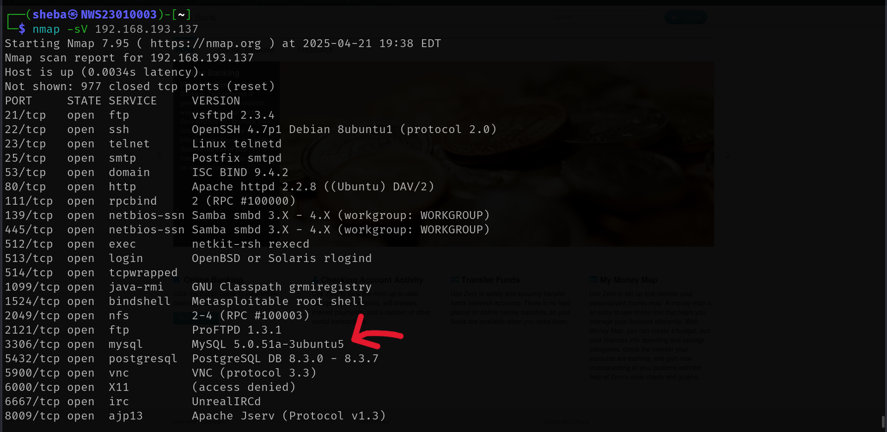

# Lab 2 Walkthrough

## Service Enumeration and Initial Access
Here we will try to get inside the target databases and see if there are any errors when we try to connect it from kali. 

1. First we need to scan the target to see if the databases port is open.

Command:
```bash
nmap -sV 192.168.193.137
```

As you can see the result show the port 3306 - mysql is open.

2. After that, we try to connect the target databases using mysql command.

If you don't know how to use mysql command, you can run the command below: 
```bash 
tldr mysql
```

It will show how to use the command.

In order to connect with the target databases, we need to run this command:
```bash
mysql -h 192.168.193.137 -u root -p
```

It ask for password, which mean there is authentication needed. BUT the error stated that the target is trying to speak SSL. The thing is the server side (kali side) we don't even speak SSL (doesn't support SSL).

### Solving the issues:
I try to run the command 
```bash 
mysql -h 192.168.193.137 -u root --ssl-mode=DISABLED -p
```

Still got error. Asked chatgpt, and it said that our MySQL target is kinda ancient.

Tried another command:
```bash 
mysql -h 192.168.193.137 -u root --ssl-mode=0
```

Still can't access but this one error is different. It state access denied for user-- which mean its the target sides the one who block the access.

Go to the target machines, and get inside the mysql terminal and check for :
```bash 
SELECT user, host FROM mysql.user; #to check the user:root if the host is set to remote (%)

#if not, run these command to allow remote connections from everywhere
UPDATE mysql.user SET host='%' WHERE user='root';
FLUSH PRIVILEGES;
```


## Enumeration of Users and Authentication Weakness

Next, we check if the password is empty. 
Command:
```bash
SELECT user, host, password FROM mysql.user;
```

Here it show the password for user root is empty and we can try again to remote access from Kali.

Run the command:
```bash
mysql -h 192.168.193.137 -u root --ssl=0 
#no -p if the password is empty
```

Yayyy, we finally can remotely connect to the target from kali!