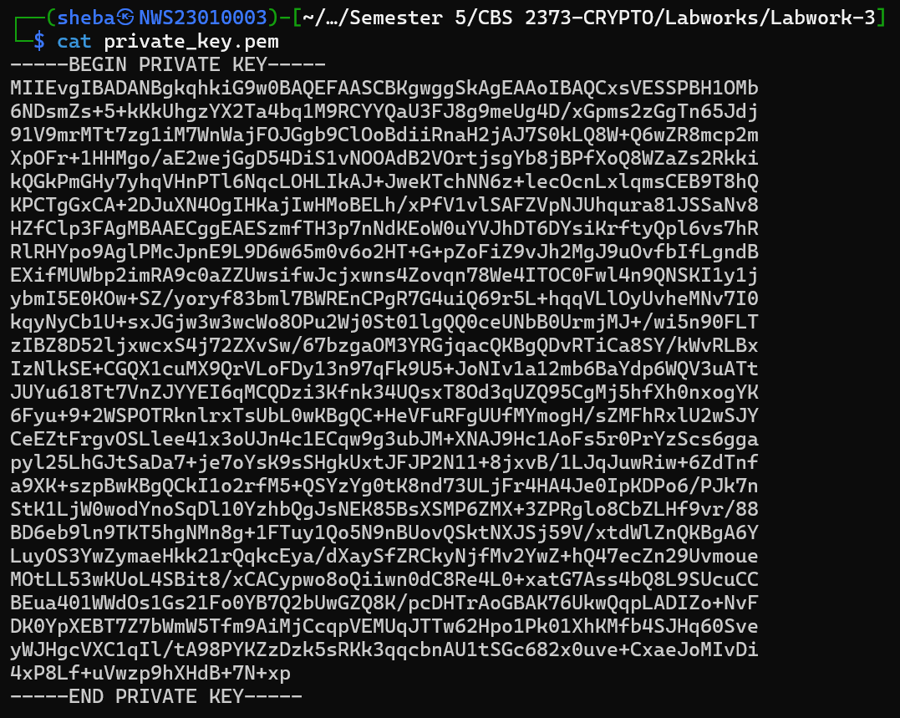
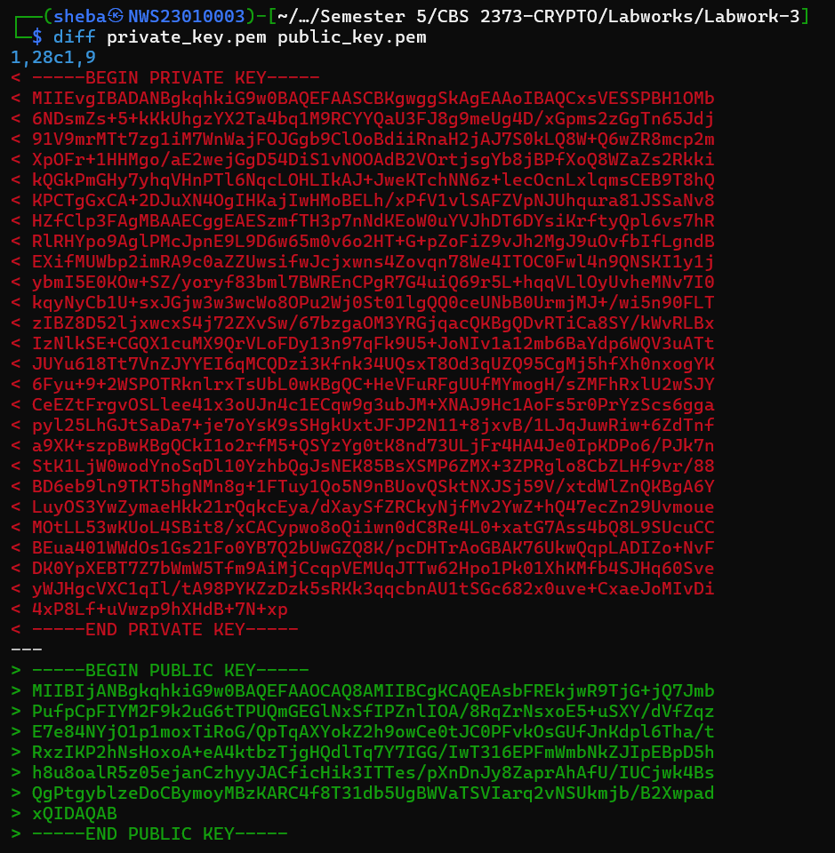

- [Task 1: Symmetric Encryption using AES](#task-1-symmetric-encryption-using-aes)
- [Task 2: Asymmetric Encryption using RSA](#task-2-asymmetric-encryption-using-rsa)
- [Task 3: Hashing and Message Integrity (SHA-256)](#task-3-hashing-and-message-integrity-sha-256)
- [Task 4: Digital Signatures using RSA](#task-4-digital-signatures-using-rsa)


## Task 1: Symmetric Encryption using AES
Here we will encrypt and decrypt a file using AES-256.

1. First, create a sample text file
   ```sh
   echo "This is a secret text." > sheba.txt
   ```
   
   

2. Next, we encrypt the file using AES-256-CBC
   ```sh
   openssl enc -aes-256-cbc -salt -in sheba.txt -out sheba.enc
   ```
   
   -  After running the command, you are required to insert any password for the encryption.
      | **Option**     | **Explanation**                                                          |
      | -------------- | ------------------------------------------------------------------------ |
      | openssl        | Call the openssl tools                                                   |
      | enc            | stands for 'encrypt' - symmetric encryption                              |
      | -aes-256-cbc   | Choosing AES cipher with 256-bit key in CBC (Cipher Block Chaining) mode |
      | -salt          | Add random 8-byte salt                                                   |
      | -in sheba.txt  | Specifies the input plaintext file                                       |
      | -out sheba.enc | Specifies the output encrypted file                                      |
   
   .png)
   - As you can see the plaintext before this has been encrypted. You can't even read it nor understand.

3. In order to decrypt the text, we need to use this command.
   ```sh
   openssl enc -d -aes-256-cbc -in sheba.enc -out sheba-decrypted.txt
   ```
   
   - Decryption need the password. Insert the password that you has setup.
      | **Option** | **Explaination** |
      | ---------- | ---------------- |
      | openssl    | Call the openssl |
      | enc        | specifies encryption       |


   .png)
   - Tadaaaa!!! We successfully encrypt the fileee.

----
## Task 2: Asymmetric Encryption using RSA 
Here we will generate an RSA key pair, encrypt a message with the public key, and decrypt it with the private key.

1. You need to generate an RSA private key (2048-bit)
   ```sh
   openssl genrsa -out private_key.pem 2048
   ```
   
   

2. Extract the public key from the private key that we just generate. 
   ```sh
   openssl rsa -in private_key.pem -pubout -out public_key.pem
   ```
   
   

   Below is the different between the private key and public key that has been generated.
   

3. Create or take any of your secret file. Encrypt the file using the Public key that we just extracted.
   ```sh
   openssl pkeyutl -encrypt -inkey public_key.pem -pubin -in shebarsa.txt -out shebarsa.txt.enc
   ```
   !
   > using `pkeyutl` because it is much more flexible, modern and supports more crypto operations. 

   if using 
   ```sh
   openssl rsautl -encrypt -inkey public_key.pem -pubin -in shebarsa.txt -out shebarsa.txt.enc
   ```
   it will show the output: 
   ```sh
   The command rsautl was deprecated in version 3.0. Use 'pkeyutl' instead.
   ```
   ![rsa-pkeyutl]
   That is why we will be using **pkeyutl** instead rsautl. 
   
   The output of encypted file.
   ![rsa-enc-output]

4. Lets decrypt the file so it is readable.
   ```sh
   openssl pkeyutl -decrypt -inkey private_key.pem -in shebarsa.txt.enc -out decrypted.txt
   ```
   

   The output of decrypted file.
   

5. The diff of encrypted file and decrypted filee.
   


----
## Task 3: Hashing and Message Integrity (SHA-256)

1. It just the same like before, prepare a file or docs that you want to encrypt but this time we will be using hashing. 
   

2. Here we will start hashing the file that has been created.
   ```sh
   openssl dgst -sha256 sheba-hash.txt
   ```
   

3. Lets edit the file and hash it again. 
   ```sh
   vim sheba-hash.txt
   ```
   

   After edit the file and hash it again, the hash will be different.

4. There are alternative tools beside the command we use before. 
   ```sh
   sha256sum sheba-hash.txt
   ```
   
   The output is still the same, it just the command that is different. 

-----
## Task 4: Digital Signatures using RSA

Here we will be making digital signatures using RSA.

1. We need to create the file that are needed. 
   ```sh
   vim sheba-agreement.txt
   ```

2. Now, we will sign the file using the private key that we already created before int task 2.
   ```sh
   openssl dgst -sha256 -sign private_key.pem -out agreement.sig sheba-agreement.txt
   ```
   agreement.sig = the digital signature file

3. Next we try to verify the signature using the public key.
   ```sh
   openssl dgst -sha256 -verify public_key.pem -signature agreement.sig sheba-agreement.txt
   ```
   if it's legit, you will get:
   ```sh
   Verified OK
   ```

4. Here we just want to check, what will happen if we modify the file?? 
   