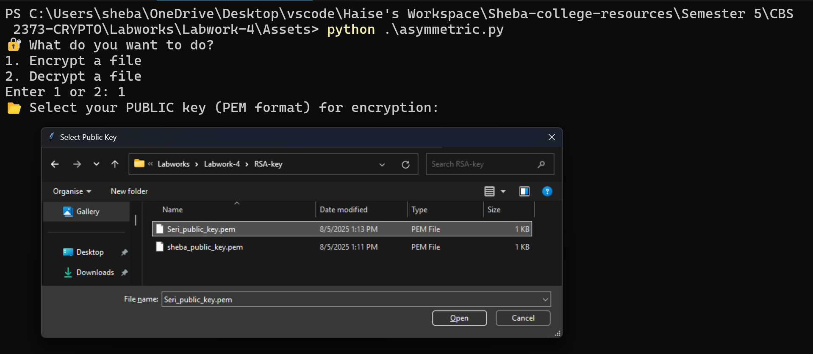
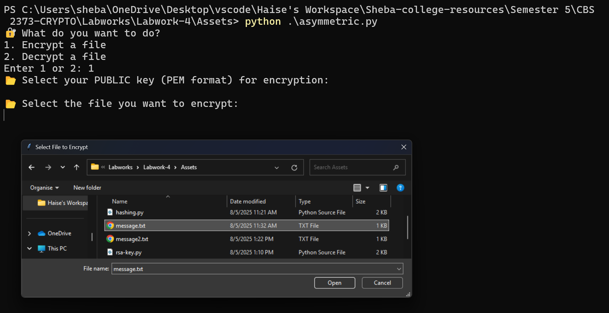
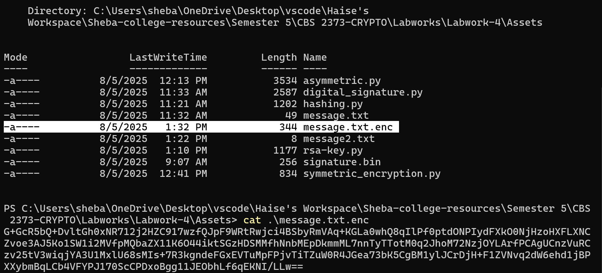

# 📑 Table of Contents
- [📑 Table of Contents](#-table-of-contents)
  - [Lab 4 Walkthrough](#lab-4-walkthrough)
    - [🔐 Task 1: Symmetric Encryption (AES)](#-task-1-symmetric-encryption-aes)
    - [🧮 Task 3: Hashing (SHA-256)](#-task-3-hashing-sha-256)
    - [✍️ Task 4: Digital Signatures (RSA)](#️-task-4-digital-signatures-rsa)


## Lab 4 Walkthrough
For this task, we need to prepare a few things before we start.

- Requirements:
  - Python 3.8++
  - Text Editor

- Install the libraries in your terminal or text editor terminal.

  ```python
  pip install pycryptodome
  pip install cryptography
  pip install rsa
  ```  
----
### 🔐 Task 1: Symmetric Encryption (AES)
First, you need to understand the concepts of [AES](../../Notes/Symmetric-Asymmetric.md).

In simple word, AES is symmetric, so same for encrypt & decrypt.

1. The first step you need to do is import the library. 
    ```python 
    from Crypto.Cipher import AES
    from Crypto.Random import get_random_bytes
    ```
2. For encrypting, you need to make sure you have the data, the key and cipher.
   ```python
    # Original data
    data = b'Cryptography Lab by Sheba, NWS23010003'

    # Generate key & cipher
    key = get_random_bytes(16)  # AES-128
    cipher = AES.new(key, AES.MODE_EAX)

    # Encrypt
    ciphertext, tag = cipher.encrypt_and_digest(data)
    nonce = cipher.nonce

    #make sure the output in hex
    print("Ciphertext (hex):", ciphertext.hex())
    print("Tag (hex):", tag.hex())
    print("Nonce (hex):", nonce.hex())
    ```

3. For decryption part, you need to create the cipher
    ```python
    # Recreate the cipher for decryption
    cipher_dec = AES.new(key, AES.MODE_EAX, nonce=nonce)

    # Decrypt and verify
    try:
        decrypted = cipher_dec.decrypt_and_verify(ciphertext, tag)
        print("Decrypted:", decrypted.decode())
    except ValueError:
        print("Decryption failed or data tampered!")
    ```
    ➡ **Full code**: [symmetric_encryption.py](Assets/symmetric_encryption.py)

**Output:**


**References**
- [reference 1](https://onboardbase.com/blog/aes-encryption-decryption/)
  
-----
### 🔑 Task 2: Asymmetric Encryption (RSA)
#### Generate Private and Public key
1. First you need to create an encrypted PEM encoded RSA key pair. With these key, we will be able to encode it in our desire format.
   
2. Here we need import the necessary library.
   ```python
   public_key_dir = "RSA-key"  # Relative, stays in your project
   private_key_path = r"C:\Users\sheba\OneDrive\Desktop\vscode\Haise's Workspace\private_key.pem"  
   # Make sure RSA-key folder exists for public key
   os.makedirs(public_key_dir, exist_ok=True)
    ```

3. Generate the private key and public key
   ```python
    # Generate RSA keys
    private_key = rsa.generate_private_key(
    public_exponent=65537,
    key_size=2048
    )

    # Serialize keys
    pem_private_key = private_key.private_bytes(
      encoding=serialization.Encoding.PEM,
      format=serialization.PrivateFormat.PKCS8,
      encryption_algorithm=serialization.NoEncryption()
    )

    pem_public_key = private_key.public_key().public_bytes(
      encoding=serialization.Encoding.PEM,
      format=serialization.PublicFormat.SubjectPublicKeyInfo
    )
    ```
4. Save the keys in specific files
   ```python
    with open(os.path.join(public_key_dir, "public_key.pem"), "wb") as f:
      f.write(pem_public_key)

    # Write private key OUTSIDE project folder
    with open(private_key_path, "wb") as f:
      f.write(pem_private_key)
    ```
#### Asymmetric Encryption
Here we will make an option for the user either they want to encrypt the file or decrypt it.

1. First you need to import necessary library.
   ```python
   import base64
   from tkinter import Tk, filedialog
   from cryptography.hazmat.primitives.asymmetric import padding
   from cryptography.hazmat.primitives import hashes,  serialization
   from cryptography.hazmat.backends import default_backend

   # 🪟 Hide the root window for file selection
   root = Tk()
   root.withdraw()
   ```
2. Create the user options.
   ```python
   print("🔐 What do you want to do?")
   print("1. Encrypt a file")
   print("2. Decrypt a file")
   choice = input("Enter 1 or 2: ").strip()
   ```
3. Encryption part.
   ```python
   if choice == "1":
    print("📂 Select your PUBLIC key (PEM format) for encryption:")
    public_key_path = filedialog.askopenfilename(title="Select Public Key")
    if not public_key_path:
        print("❌ No public key selected. Exiting.")
        exit()

    print("\n📂 Select the file you want to encrypt:")
    file_to_encrypt = filedialog.askopenfilename(title="Select File to Encrypt")
    if not file_to_encrypt:
        print("❌ No file selected. Exiting.")
        exit()

    # Load public key
    with open(public_key_path, "rb") as f:
        public_key = serialization.load_pem_public_key(f.read())

    # Read file content
    with open(file_to_encrypt, "rb") as f:
        file_content = f.read()

    # Encrypt it
    ciphertext = public_key.encrypt(
        file_content,
        padding.OAEP(
            mgf=padding.MGF1(algorithm=hashes.SHA256()),
            algorithm=hashes.SHA256(),
            label=None
        )
    )

    # Save as base64
    ciphertext_base64 = base64.b64encode(ciphertext).decode('utf-8')
    encrypted_file_path = file_to_encrypt + ".enc"
    with open(encrypted_file_path, "w") as f:
        f.write(ciphertext_base64)

    print(f"✅ Encrypted file saved as: {encrypted_file_path}")
    ```
4. Decryption part
   ```python
   elif choice == "2":
    print("📂 Select your PRIVATE key (PEM format) for decryption:")
    private_key_path = filedialog.askopenfilename(title="Select Private Key")
    if not private_key_path:
        print("❌ No private key selected. Exiting.")
        exit()

    print("\n📂 Select the encrypted file to decrypt (base64 format):")
    encrypted_file_path = filedialog.askopenfilename(title="Select Encrypted File")
    if not encrypted_file_path:
        print("❌ No encrypted file selected. Exiting.")
        exit()

    # Load private key
    with open(private_key_path, "rb") as f:
        private_key = serialization.load_pem_private_key(f.read(), password=None)

    # Read and decode ciphertext
    with open(encrypted_file_path, "r") as f:
        encrypted_message = f.read()
    ciphertext = base64.b64decode(encrypted_message)

    # Decrypt
    try:
        decrypted_message = private_key.decrypt(
            ciphertext,
            padding.OAEP(
                mgf=padding.MGF1(algorithm=hashes.SHA256()),
                algorithm=hashes.SHA256(),
                label=None
            )
        )

        decrypted_file_path = encrypted_file_path + ".dec"
        with open(decrypted_file_path, "wb") as f:
            f.write(decrypted_message)

        print(f"✅ Decrypted file saved as: {decrypted_file_path}")

    except Exception as e:
        print("❌ Decryption failed.")
        print("Reason:", str(e))
    ```

6. To ensure the user insert the only options that has been state.
   ```python
   else:
    print("🤨 Invalid choice. Please enter 1 or 2 next time.")
   ```
**Output**:
  - Encryption (Seri's Public Key)
    
    
    

  - Decryption (Seri's Private Key)
    
        

➡ **Full code**: 
  - [rsa-key.py](Assets/rsa-key.py)
  - [asymmetric.py](Assets/asymmetric.py)
  
**References**
- [reference 1](https://dev.to/aaronktberry/generating-encrypted-key-pairs-in-python-69b)

-----
### 🧮 Task 3: Hashing (SHA-256)
In this task, we wil be trying to hash 2 files but make the user choose the file from their own directory.

1. You need to import the necessary library first.
   ```python
   import hashlib
   from tkinter import Tk, filedialog

   # Hide the root Tk window
   root = Tk()
   root.withdraw()
   ```

2. Create the code for user to choose two files.
   ```python
   print("📂 Select the first file:")
   file1 = filedialog.askopenfilename(title="Select the first file")
   print(f"✅ First file selected: {file1}")

   print("\n📂 Select the second file:")
   file2 = filedialog.askopenfilename(title="Select the second file")
   print(f"✅ Second file selected: {file2}")
   ```

4. Make the hash function to hash the file.
   ```python
   def hash_file(file_path):
    hash_sha256 = hashlib.sha256()
    try:
        with open(file_path, "rb") as f:
            while chunk := f.read(4096):
                hash_sha256.update(chunk)
        return hash_sha256.hexdigest()
    except FileNotFoundError:
        print("❌ File not found.")
        return None

   # Hash both files
   hash1 = hash_file(file1)
   hash2 = hash_file(file2)
   ```

5. In order to display it, you need to print out.
   ```python
    if hash1 and hash2:
      print("\n---SHA-256 HASHES---")
      print(f"File 1: {file1}")
      print(f"Hash: {hash1}")
      print(f"File 2: {file2}")
      print(f"Hash: {hash2}")
   ```

6. This part is **optional**, just for verify if the messages or inputs has been tampered or not.
    ```python
    if hash1 == hash2:
        print("\n✅ Hashes MATCH")
    else:
        print("\n❌ Hashes DO NOT MATCH")
    ```
 ➡ **Full code**: [hashing.py](Assets/hashing.py)

 **Output:**
 - Not match
  
   

 - Match
  
   

**References**
- [reference 1](https://iamholumeedey007.medium.com/python-hashing-and-salting-2987ec73fa7c)
----
### ✍️ Task 4: Digital Signatures (RSA)
For this task, we will be using the `cryptography` library in Python and the key that we have generated before. 

1. Import the necessary library.
   ```python
   from cryptography.hazmat.primitives.asymmetric import padding
   from cryptography.hazmat.primitives import hashes, serialization
   from cryptography.hazmat.backends import default_backend
   from tkinter import Tk, filedialog
   import os

   # Hide Tkinter root window
   root = Tk()
   root.withdraw()
   ```
2. Create an option either want to sign or verify the file.
   ```python
   while True:
    print("\n💬 What do you want to do?")
    print("1. ✍️  Sign a file")
    print("2. 🔎  Verify a signature")
    choice = input("👉 Enter 1 or 2: ").strip()
    if choice in ["1", "2"]:
        break
    print("🚫 Invalid choice. Please enter 1 or 2.")

    # --------- FILE PICKING ---------
    if choice == "1":
        print("\n📂 Select the PRIVATE key (PEM format):")
        private_key_path = filedialog.askopenfilename(title="Select Private Key")
        print(f"🔐 Private key selected: {private_key_path}")

    elif choice == "2":
        print("\n📂 Select the PUBLIC key (PEM format):")
        public_key_path = filedialog.askopenfilename(title="Select Public Key")
        print(f"🔓 Public key selected: {public_key_path}")

    print("\n📄 Select the file to use:")
    message_path = filedialog.askopenfilename(title="Select File")
    print(f"📝 File selected: {message_path}")

    signature_path = message_path + ".sig"
   ```
3. For signing part.
   ```python
   if choice == "1":
    with open(private_key_path, "rb") as key_file:
        private_key = serialization.load_pem_private_key(
            key_file.read(),
            password=None,
            backend=default_backend()
        )

    if os.path.exists(signature_path):
        print(f"\nℹ️ Signature already exists: {signature_path} — skipping signing")
    else:
        with open(message_path, "rb") as f:
            message = f.read()

        signature = private_key.sign(
            message,
            padding.PSS(
                mgf=padding.MGF1(hashes.SHA256()),
                salt_length=padding.PSS.MAX_LENGTH
            ),
            hashes.SHA256()
        )

        with open(signature_path, "wb") as f:
            f.write(signature)

        print(f"\n✅ Signature created and saved as: {signature_path}")
    ```
4. Verify the signature. This will detect if the file has been tampered or not.
   ```python
   elif choice == "2":
    with open(public_key_path, "rb") as key_file:
        public_key = serialization.load_pem_public_key(
            key_file.read(),
            backend=default_backend()
        )

    try:
        with open(message_path, "rb") as f:
            message = f.read()
        with open(signature_path, "rb") as f:
            signature = f.read()

        public_key.verify(
            signature,
            message,
            padding.PSS(
                mgf=padding.MGF1(hashes.SHA256()),
                salt_length=padding.PSS.MAX_LENGTH
            ),
            hashes.SHA256()
        )
        print("\n✅ Signature is VALID. File is clean.")
    except Exception as e:
        print("\n❌ Signature verification FAILED.")
   ```

   **Output**:


➡ **Full code**: [digital_signature.py](Assets/digital_signature.py)
