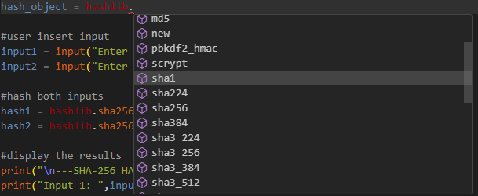

# 📑 Table of Contents
- [📑 Table of Contents](#-table-of-contents)
  - [Lab 4 Walkthrough](#lab-4-walkthrough)
    - [🔐 Task 1: Symmetric Encryption (AES)](#-task-1-symmetric-encryption-aes)
    - [✍️ Task 4: Digital Signatures (RSA)](#️-task-4-digital-signatures-rsa)

## Lab 4 Walkthrough
For this task, we need to prepare a few things before we start.

- Requirements:
  - Python 3.8++
  - Text Editor

- Install the libraries in your terminal or text editor terminal.

  ```sh
  pip install pycryptodome
  pip install cryptography
  pip install rsa
  ```  

### 🔐 Task 1: Symmetric Encryption (AES)
First, you need to understand the concepts of [AES](../../Notes/Symmetric-Asymmetric.md).

In simple word, AES is symmetric, so same for encrypt & decrypt.

1. The first step you need to do is import the library. 
    ```sh 
    from Crypto.Cipher import AES
    from Crypto.Random import get_random_bytes
    ```
2. For encrypting, you need to make sure you have the data, the key and cipher.
   ```sh
    # Original data
    data = b'Cryptography Lab by Sheba, NWS23010003'

    # Generate key & cipher
    key = get_random_bytes(16)  # AES-128
    cipher = AES.new(key, AES.MODE_EAX)

    # Encrypt
    ciphertext, tag = cipher.encrypt_and_digest(data)
    nonce = cipher.nonce

    print("Ciphertext:", ciphertext)
    print("Tag:", tag)
    print("Nonce:", nonce)
    ```

3. For decryption part, you need to create the cipher
    ```sh
    # Recreate the cipher for decryption
    cipher_dec = AES.new(key, AES.MODE_EAX, nonce=nonce)

    # Decrypt and verify
    try:
        decrypted = cipher_dec.decrypt_and_verify(ciphertext, tag)
        print("Decrypted:", decrypted.decode())
    except ValueError:
        print("Decryption failed or data tampered!")
    ```
    ➡ **Full code**: [symmetric_encryption.py](Assets/symmetric_encryption.py)
Output:


**References**
- [reference 1](https://onboardbase.com/blog/aes-encryption-decryption/)
  
-----
### 🔑 Task 2: Asymmetric Encryption (RSA)
1. First you need to create an encrypted PEM encoded RSA key pair. With these key, we will be able to encode it in our desire format.
   ```sh
   from cryptography.hazmat.primitives.asymmetric import rsa
    private_key = rsa.generate_private_key(
      public_exponent=65537,
      key_size=2048
    )
    ```
2. 

**References**
- [reference 1](https://dev.to/aaronktberry/generating-encrypted-key-pairs-in-python-69b)

-----
### 🧮 Task 3: Hashing (SHA-256)

1. You need to import the hashlib libary first.
   ```sh
   import hashlib
   ```

2. After that, you need to create hash object.
   ```sh
   hash_object = hashlib.sha3_256()
   ```
   If you are using vscode, the hashlib will show differents hash. 
   

3. To make user insert their inputs or messages. 
   ```sh
   input1 = input("Enter first input: ")
   input2 = input("Enter second input: ")
   ```

4. User already inserted their inputs, we need to hash it.
   ```sh
   hash1 = hashlib.sha256(input1.encode()).hexdigest()
   hash2 = hashlib.sha256(input2.encode()).hexdigest()
   ```
5. In order to display it, you need to print out.
   ```sh
   print("\n---SHA-256 HASHES---")
   print("Input 1: ",input1)
   print("Hash: ", hash1)
   print("Input 2: ",input2)
   print("Hash: ", hash2)
   ```

6. This part is **optional**, just for verify if the messages or inputs has been tampered or not.
    ``` sh 
    if hash1 == hash2:
      print("\n Hashes MATCH")
    else:
        print("\n Hashes NOT MATCH")
    ```
 ➡ **Full code**: [hashing.py](Assets/hashing.py)

 **Output:**
 - Not match
   
 - Match
   

**References**
- [reference 1](https://iamholumeedey007.medium.com/python-hashing-and-salting-2987ec73fa7c)
----
### ✍️ Task 4: Digital Signatures (RSA)
