- [Practical Test 1 Walkthrough](#practical-test-1-walkthrough)
  - [Task 1: Generate Your GPG Key Pair](#task-1-generate-your-gpg-key-pair)
    - [Results](#results)
  - [Task 2: Encrypt and Decrypt a File](#task-2-encrypt-and-decrypt-a-file)
    - [Results](#results-1)
  - [Task 3: Sign and Verify a Message](#task-3-sign-and-verify-a-message)
    - [Results](#results-2)
  - [Task 4: Configure Passwordless SSH Authentication](#task-4-configure-passwordless-ssh-authentication)
    - [Results](#results-3)
  - [Task 5: Hash Cracking Challenge](#task-5-hash-cracking-challenge)
    - [Results](#results-4)


# Practical Test 1 Walkthrough
## Task 1: Generate Your GPG Key Pair

Objective: Use `gpg` to generate an RSA key pair tied to your identity.

- Input:

- Name: Your Name
- Email: Your academic email
- Key Type: RSA
- Key Size: 4096 bits
- Expiry: 1y

- Expected Output: GPG key fingerprint, with `gpg --list-keys` showing your identity.
  
### Results
1.  `gpg --generate-key`
    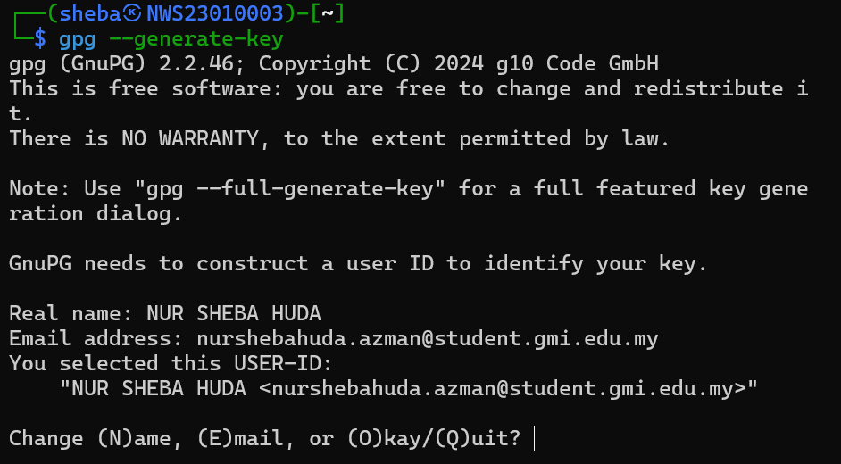
    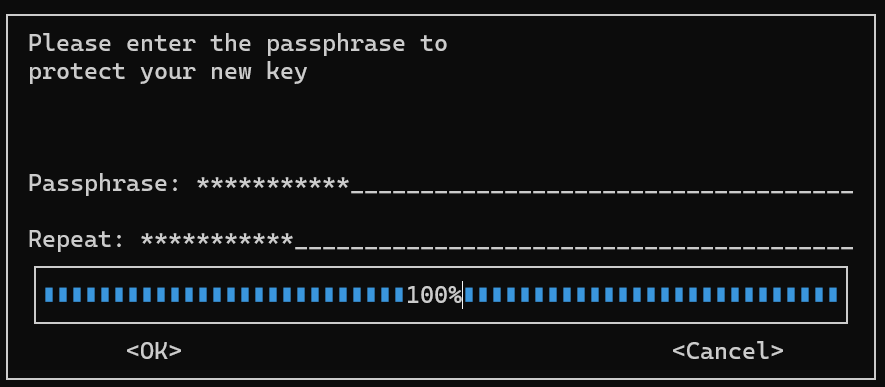
    

2. `gpg --full-generate-key`
   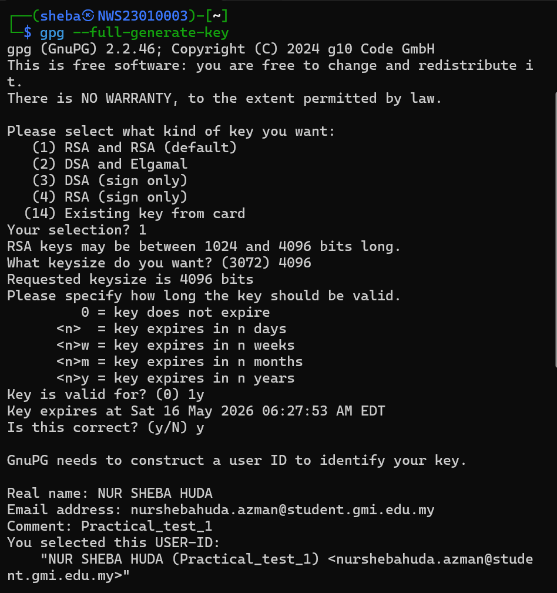
   
3. `gpg --list-key`
   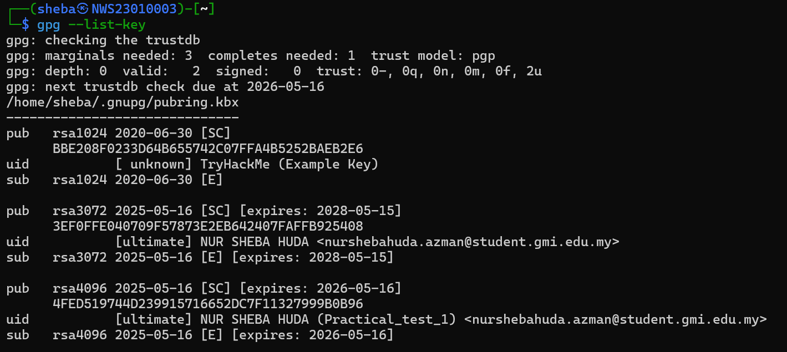

---
## Task 2: Encrypt and Decrypt a File

Objective: Perform GPG encryption and decryption.

- Create a file `message.txt` containing:
`This file was encrypted by [Your Name] ([Your Student ID])`

- Encrypt `message.txt` using your own public key (for self-decryption).

- Decrypt the resulting file and verify the contents.

- Expected Output: Clear file content recovered.

### Results
1. Created `message.txt`
   

2. Encrypt `message.txt` using:
   ```sh
   gpg -c message.txt
   ```
   

3. After encrypt, the encrypted file will be save in `.gpg` . 
   

4. Check the type of encryption and the content of encrypted file. 
   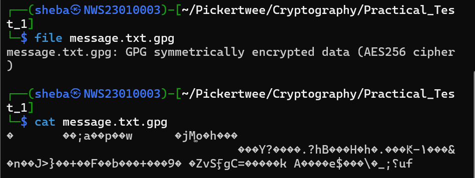
   As you can see, the file has been encrypted.


5. In order to decrypt it, using the following command 
   ```sh 
   gpg -d message.txt.gpg
   ```
   
   or
   extract as a file: 
   ```sh
   gpg -d -o dec-message.txt message.txt.gpg
   ```
   
   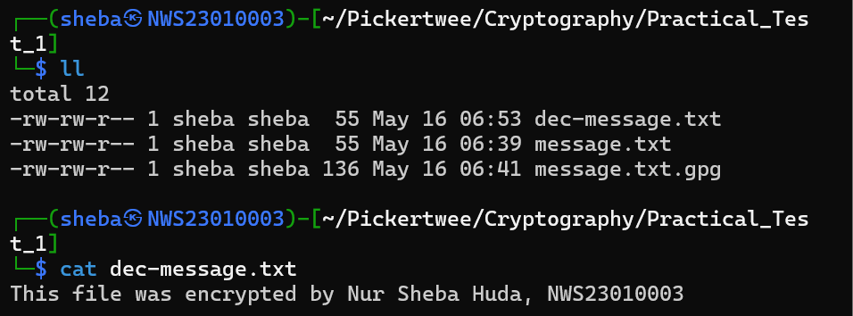

---
## Task 3: Sign and Verify a Message

Objective: Digitally sign a message and verify its authenticity.

- Step A: Create a signed message file `signed_message.txt` that contains:
`I, [Your Name], declare this is my work.`

- Step B: Sign the file using GPG (`--clearsign` or `--detach-sign`)

- Step C: Verify your signature using `gpg --verify`

### Results
1. Created `signed_message.txt`
   

2. Digital sign using my own key. From the `gpg --list-keys`.
    ```sh
    gpg --local-user 4FED519744D239915716652DC7F11327999B0B96 --clearsign signed_message.txt 
    ```
   

3. Make sure the file has been signed. 
   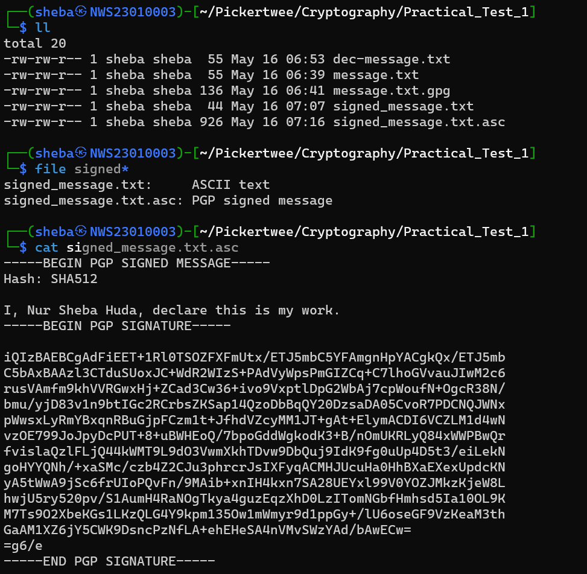

4. Verify the signed file. 
   

---
## Task 4: Configure Passwordless SSH Authentication

Objective: Set up SSH key-based login to a simulated server (or localhost if isolation is used).

- Generate an SSH key pair using your name and ID as comment.
`ssh-keygen -C "[Your Name]-[ID]"`

- Configure passwordless login to a test VM or localhost (`~/.ssh/authorized_keys`).

- Test authentication by logging in and creating a file `Your_Name.txt` containing “[Your_Student_ID]”

- Evidence Required:

- Show the SSH key comment in the public key.
- Show login command working without password.
- Screenshot of `ssh user@ssh-server "echo Your_Student_ID > Your_Name.txt"` from your local computer.
- Screenshot of `ssh user@ssh-server "cat Your_Name.txt"` from your local computer.
- Screenshot of `whoami` from remote shell.

### Results
1. Before configure passwordless SSH.
   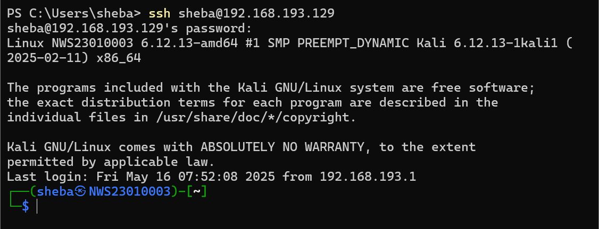

2. Generate the `ssh-keygen` first.
   - In **Windows** terminal
   ssh-keygen.png)
   - In **Kali Linux** terminal
   ssh-keygen.png)

3. Check on the generated key, and copy the `id_ed25519.pub` from **Windows** to `authorized_keys` in **Kali Linux**.
   
   

4. Add permissions.
   

5. After configure.
   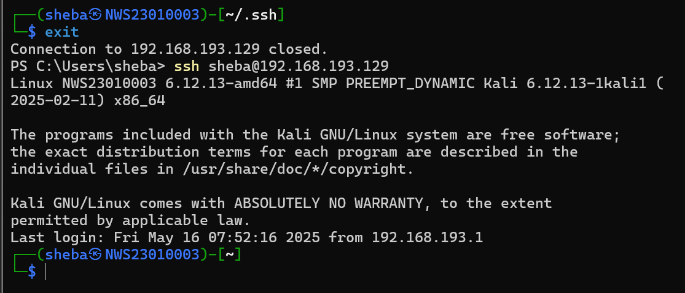

6. To proof the authentication, here I will be making a file from **Windows** terminal and check if the file is also exist in **Kali Linux** terminal. 
   - Here, I create the file remotely, and check the content of the file.
   
   - Just to double-check if the file exists on the remote machine, I SSH'd into it and verified manually. 
   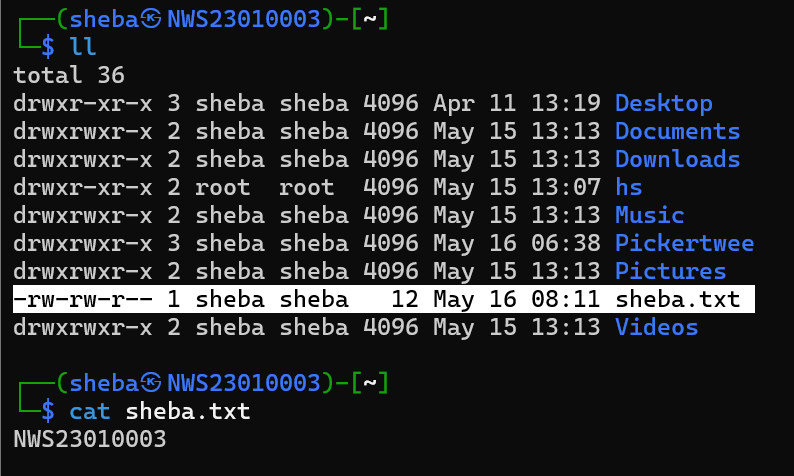
   As you can see, the file is exist!

7. To check who are the user remotely.
   
   
-----
## Task 5: Hash Cracking Challenge

Objective: Crack provided hashes.

- Hashes Provided (Variety of types):

- SnZlcmV4IEF2IEpmcmNyZSBFeiBCcnJl
- 7b77ca1e2b3e7228a82ecbc7ca0e6b52
- e583cee9ab9d7626c970fd6e9938fcb2d06fbbd12f1c1a3c6902a215808c825c

- Expected Output:

- Plaintext value for each hash
- Tool/wordlist/method used for cracking

### Results
1. **hash1.txt** > `SnZlcmV4IEF2IEpmcmNyZSBFeiBCcnJl`
   
   For the first challenge, I try using the online tools to detect what type of hashing it use. 
   By using the [CyberChef](https://gchq.github.io/CyberChef/), it showed that the input was encoded in Base64, and after decoding, another layer of ciphertext was revealed. 
   magic.png)
   Based on the result: `Jverex Av Jfrcre Ez Brre`, I assume it was decrypted in [Caesar Cipher](https://www.geeksforgeeks.org/caesar-cipher-in-cryptography/).

   - Output:
    To decode it, I'm using the online tool [dcode](https://www.dcode.fr/caesar-cipher). 
    output.png)
    The tool does its thing by brute-forcing the hash until a readable, logical plaintext pops up.
    Plaintext: `Senang Je Soalan Ni Kaan`

2. **hash2.txt** > `7b77ca1e2b3e7228a82ecbc7ca0e6b52`
   
   In order to know what type of hashing that it use, I used the **hash-identifier** tool.
   scan.png)
   As you can see, the possible hashes that it stated are **MD5**. 

   So, in order to crack it, I will using the **hashcat** and the [wordlists.txt](./Assets/wordlist.txt)
   ```sh
   hashcat -m 0 hash2.txt wordlists.txt --force
   ```
   - Output:
    output.png)
    plaintext: `Assalamualaikum Semua`

3. **hash3.txt** >  `e583cee9ab9d7626c970fd6e9938fcb2d06fbbd12f1c1a3c6902a215808c825c`
   
   Same as the previous question, I already did some checking with the hash and the results show that the possible hashing is **SHA256**.
   scan.png)

   In order to crack it, I'm using the same tool which is **hashcat** and the same wordlists. 
   ```sh
   hashcat -m 1400 hash3.txt wordlists.txt --force
   ```
   output.png)
   plaintext: `Begitula Lumrah Kehidupan`

    -----
    ### Explanation regarding the hashcat command
    
    | **Part**      | **What It Does**                  |
    | ------------- | --------------------------------- |
    | `hashcat`       | start the tool                    |
    | `-m <mode>`     | tell the hashcat the type of hash |
    | `hash2/3.txt`   | File that you want to decrypt     |
    | `wordlists.txt` | Lists of possible plaintext       |
    | `--force`       | Forcing hashcat to run            |

    **But how to know the mode???**
    - By using the following command: 
        ```sh
        hashcat --help
        ```
        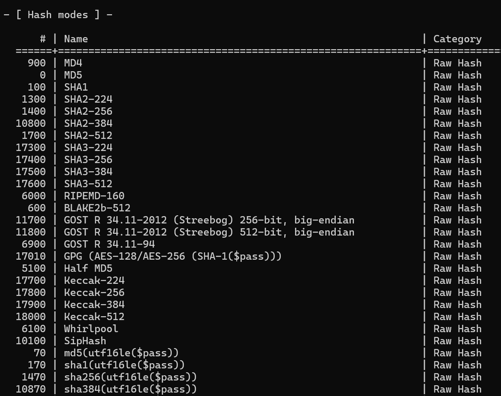
    - Run the command and it’ll show all the hash modes, so you can pick the one that fits whatever you’re cracking.
