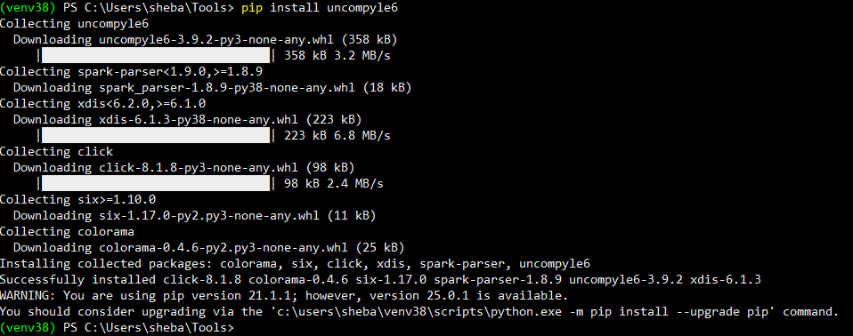

- [Practical Test 1 Walkthrough](#practical-test-1-walkthrough)
  - [Introduction](#introduction)
  - [Terms](#terms)
  - [Requirement for this Lab](#requirement-for-this-lab)
  - [Preparation](#preparation)
    - [Create Virtual Environtment](#create-virtual-environtment)
    - [Install decompiler](#install-decompiler)


# Practical Test 1 Walkthrough
## Introduction
So, in this practical test.. we will be simulate a ransomware by decrypting the ransomware to get the actual file. Ransomware is a malicious real-world application of cryptography

From the file that we already get, it will be one type of programming language. After the file has been execute, it will give an output where there are 3 files that has been encrypted. We need to figure out on how to decrypt the file to readable content.

## Terms
1. OS - Operating System
2. 

## Requirement for this Lab
| **Tools/Software**   | **Description**                                                               | **Source**                                                       |
| -------------------- | ----------------------------------------------------------------------------- | ---------------------------------------------------------------- |
| Windows 10           | An OS that will be using to run the ransomware without harming our actual OS. | https://www.microsoft.com/en-us/software-download/windows10      |
| Python 3.8           | To run the Python based tools                                                 | https://www.python.org/ftp/python/3.8.10/python-3.8.10-amd64.exe |
| pyinstaller          | Converting the binary to .exe                                                 | https://www.google.com/search?q=pyinstaller+Decompiler           |
| pyinstxtrator        | Extract files from PyInstaller executables (.exe)                             | `pip install pyinstxtrator`                                      |
| uncomplye6           | Python decompiler                                                             | `pip install uncomplye6`                                         |
| Everything           | For easier to find any files by name/path.                                    | https://www.voidtools.com/downloads/                             |
| 7z                   | To extract any .zip file                                                      | https://www.7-zip.org/download.html                              |
| x2Lite               |                                                                               | https://www.zabkat.com/x2lite.htm                                |
| Detect It Easy (DiE) | Identify the programming language                                             | https://www.majorgeeks.com/files/details/detect_it_easy.html     |
| VS Code              | An IDE to run any programming language                                        | https://code.visualstudio.com/download                           |

-----
## Preparation
All the activities will be handle in the Windows 10 and Windows Powershell (Run as administrator). There are some tools that I will show the steps, as the others tools you can directly download it from source given.

### Create Virtual Environtment 
Before we start analyze the .zip file, makes sure you setup your Virtual Environment first.
1. Ensure you already install your **Python 3.8** inside your Windows 10. 
   
   As you can see, there are 2 version of python but we wil be using the 3.8 version and set it as the virtual environment.

2. Run the following command:
   ```sh
   py -3.8 -m venv venv38
   ```
    

3. Activate the environment
   ```sh 
   .\venv38\Scripts\activate
   ```
    
    After you activate, the terminal line will show the `ven38`. 

### Install decompiler
To install the decompiler, run the following command:
```sh 
pip install uncomplye6
```


As the results show that we need to upgrade the `pip`, just copy the following command and run it. 

Or

```sh
python -m pip install --upgrade pip
```
----
Now you are ready to start doing the Malware Analysis! Yoohooo

Full guide➡️: [Walkthrough.md](Walkthrough.md)
