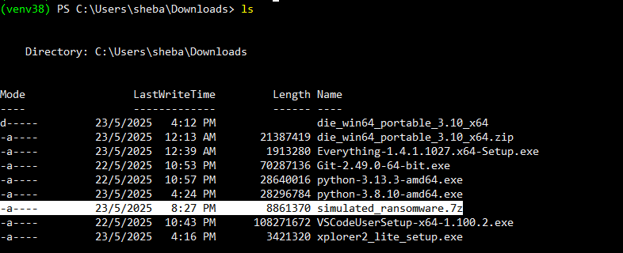
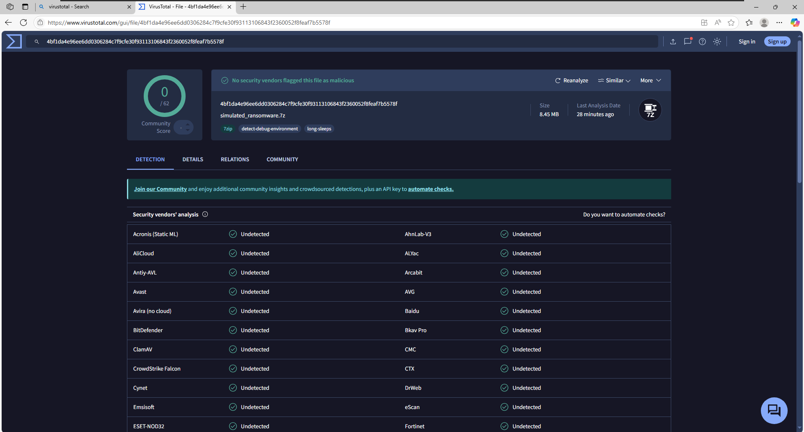
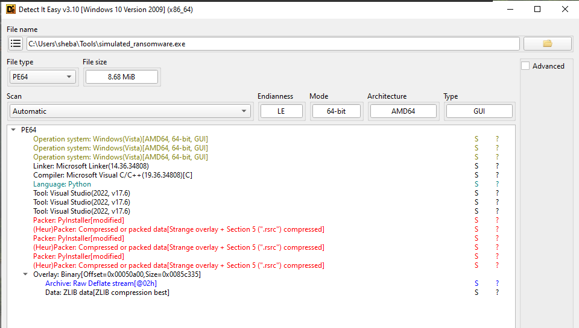
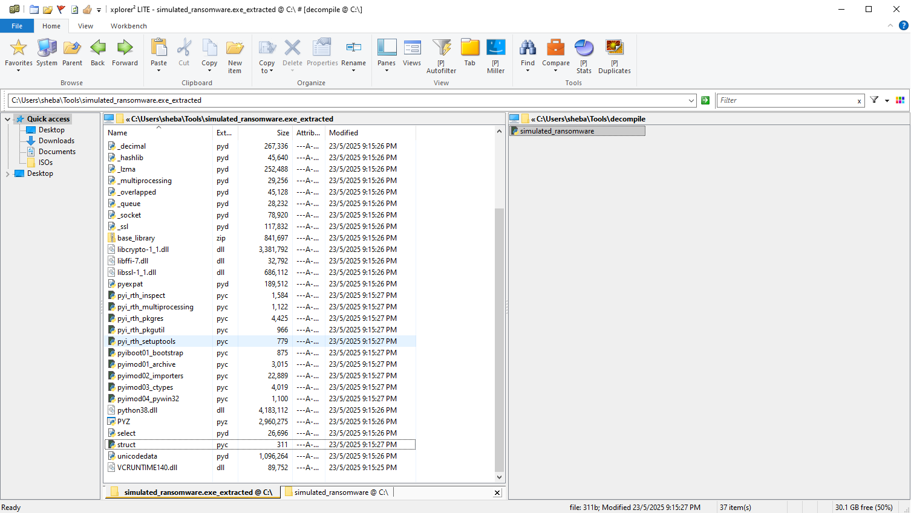
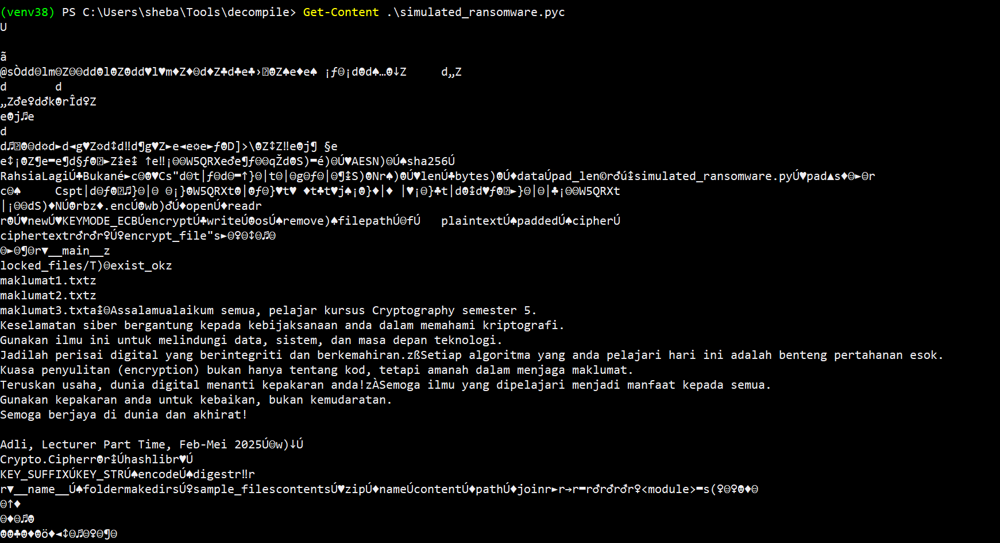
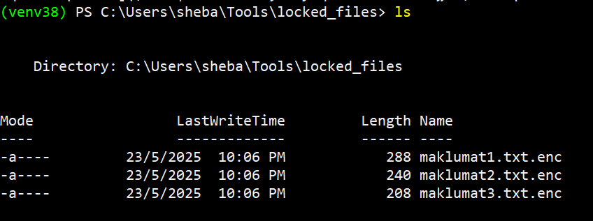

- [Analysis of the Ransomware](#analysis-of-the-ransomware)
  - [File Path](#file-path)
  - [Check the Hash](#check-the-hash)
  - [Identify the Language](#identify-the-language)
  - [Converting the .exe file to .pyc file](#converting-the-exe-file-to-pyc-file)
  - [Converting .pyc file to .py file](#converting-pyc-file-to-py-file)
  - [Run the .py file in VSCode](#run-the-py-file-in-vscode)
    - [Output after successfully run the code](#output-after-successfully-run-the-code)
  - [Decrypting the .txt.enc file](#decrypting-the-txtenc-file)


# Analysis of the Ransomware
> ❗The first thing if you have receive/download a ransomware file, DO NOT EVER open it in your own laptop. To be safe, open it in you vm machine so it doesn't affect to your own laptop. 

For this lab, we will be using the operating system [Windows 10.iso file](). Make sure you already download it in your VM.

## File Path
For the ransomware file, I already download the .zip file in Windows 10, and here is the file path:
    `C:\Users\sheba\Downloads`
    

## Check the Hash
So, if you already have the ransomware in your Windows 10:
    - Check the hash file to ensure it is the legit file that you have download. 
    - Use virustotal to check whether the ransomware is to make a quick malware check and see if the file has been roaming somewhere.

1. Using `Get-FileHash` to check the file hash.
   ➡️File hash: `4BF1DA4E96EE6DD0306284C7F9CFE30F93113106843F2360052F8FEAF7B5578F`
   
   
2. Copy and paste the hash to virustotal to check the if the file is safe or not.
   
   - The results that we get by scanning the hash in virustotal stated that there is **zero** detection. Which mean the file is clean.

## Identify the Language
After we confirm the file integrity, we need to identify what kind of language does it use. Here we will be using DiE to identify it. Before that, you need to extract it. 

I already extracted the .zip file and put it in the folder that I desire. 
.png)

Here is the POV from the File Explorer if you are not used to view the file from Windows Powershell.
extractedfilepath.png)

Move on to the next step, open your DiE. It should be looking like this.


You can just drag and drop the .exe file and it will do their job. The output will be like this:

From the scanning, it show that:
    - The languange it use is **Python** and is executable using **Pyinstaller**.
    - It use Microsoft Visual C/C++ to compile
    - The OS it use is Windows Vista.

---
## Converting the .exe file to .pyc file 
This is the part where you will be converting the **.exe** file to **.pyc** file.

But how to convert it??? 

Alright.. In order to convert it, you need to run the following command:
```powershell
.\pyinstxtractor-ng.exe .\simulated_ransomware.exe
```
Ensure you run it in the path where the file has been saved.
The outcome should be looking like below:
.png)
The new filename should be `simulated_ransomware.exe` .

The possible file to convert it into **.py** file has been stated from the results, which is `simulated_ransomware.pyc`. This is the file that we will be converting it into readable text for human. 

I already move the file into a new folder (decompile), it is just to make me easy to decompile it later. 

- I'm using **xplore lite** to make it easy for me to identify the file path and move the file to another folder. 


Here we can easily get the access of the file and lets see the content. Is it readable or not?
To view the content:
```powershell
Get-Content <filename.pyc>
```

As you can see, there are word you can read but most of it you can't understand what does it mean. This is because the file is in .pyc format and it is not readable. 

----
## Converting .pyc file to .py file
In order to make it readable, you need to convert the .pyc file to .py file.

To do so, you need to have a compiler. You need to ensure the compiler is for python language.

I'm using `uncompyled6` to decompile the file.
```powershell
uncompyle6 <flag> <path for the file to be save> <.pyc file>
uncompyle6 -o . simulated_ransomware.pyc
```


----
## Run the .py file in VSCode
Ensure the folder you currently use is already in the VSCode.
If you open the .py file, it will show the code as below:


There will be some error occurs when running the code. 
1.  ```sh
    Traceback (most recent call last):
    File "c:\Users\sheba\Tools\decompile\simulated_ransomware.py", line 5, in <module>
        from Crypto.Cipher import AES
    ModuleNotFoundError: No module named 'Crypto'
    ```
- Need to install the pycryptodome module.
  ```sh
  PS C:\Users\sheba\Tools> c:\Users\sheba\Tools\.venv\Scripts\python.exe -m pip install pycryptodome
  ```
2. After, fixing the first error. There is another one state:

   - it state that the **NoneType** object is not subscriptable. 
   - In order to make it run, remove the **none** in line 10.
   - the line should be like this:
    `KEY = sha256(KEY_STR.encode()).digest()[:16]`

### Output after successfully run the code
By running the code, it will create a folder named `locked_files`

Inside the folder, there is three encrypted .txt file. If we take a look the content, it is unreadable..


----
## Decrypting the .txt.enc file
For the decrypting part, you need to create the code for decrypting it. Basically you just reverse the previous encrypted code. 

Full Code➡️: [Decrypted.py](Decrypted/Decrypted.py)

From the code, I make sure the output is save in new folder instead of overwrite it.


----
